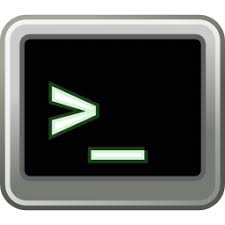

# Basics of the command line

This section is designed to give you a "very" brief introduction to the command line.

We will explain the commands, flags and special characters you need to be aware of in order to run a **Nextflow** pipeline.

This is not meant to be exhaustive, but gives you the main info you need to know.

## What is the terminal



The terminal is where you give instructions to tell the computer what to do!

In bioinformatics, we use a UNIX terminal, which is an operating system (OS) with a core set of commands/programs available to run code and operate on a computer. The following commands in this tutorial are all UNIX commands and are the main way to interact with your computer. 

These are some additional terms you may hear:

LINUX: A flavor of unix which is UNIX based aand 
CLI: Command line interface (your terminal)
UI: User interface (your desktop layout with click icons)

On a MacOS or LinuxOS machine you will have a UNIX terminal by default. On Windows machines you may have to download a terminal app to have a UNIX feel terminal to run bioinformatics in. Such as the Windows Subsystem for Linux (WSL). For this tutorial we are in a unix compueter, so have a terminal in unix as standard.

## Commands:


These are some basic unix commands that you need to familiarize yourself with:

`man`	Print the manual of a command

`ls`	Show all the files in the current directory

`pwd`	Tell me which directory I am in right now

`tree`  Print the directory structure

`cd`	Change directories<br>
(use as `cd ./directory` ,  change to a folder called directory in my current dir)<br>
(or `cd ..` , go up one directory)
(or `cd -` , back to previous directory)
(or `cd` , takes you to home directory)

`cp`	Move a file/folder (keep original; -r for recursively [also to copy a directory])

`mv`	Move a file/folder (and delete original)

`rm`	Remove/Delete a file (-r for recursively [also to remove a directory])

`mkdir`	Make a new directory

`chmod`	Change the users rights (mode) of a file 
(u:users a:all g:group o:other)
(+-)
(r:read w:write x:execute)
(e.g. chmod a+r file , make all users read file)

`nano`	Open the nano command line text editor<br>
(`nano file_name`, then exit/save by typing control X, checking the name is correct and entering `y`)

`wc` 	Word Count (with flag –l prints the # of lines in a file). By default prints the lines, words, characters

`grep`	Search for a string/word inside a file and print lines

`echo`	Prints statement to terminal or prints the contents of a variable ($)

`history`	Check out all my previous commands

`cat`	Print all lines or concatenate files

`head`	Print the top lines of a file (-n number of lines)

`tail`	Print the bottom lines of a file (-n number of lines)

`uniq`	Print unique lines

`sort`  Sort a list 

`wget`	Copy the contents of a webpage to the current directory

`which`  Tell me the path to the script/program (e.g. `which perl`)


## Extra commands you should know (but not needed in this course)

`ssh`	Access a remote server/cluster

`export`	Usually setting an environmental variable

`open`	Try to open a file type in expected way, e.g. PDF 


## Flags (for the command `ls`):


`-l`	long format

`-r`	reverse order

`-a`	show hidden files

`-h`	human readable (size)

`-t`	sort by time changed

`-G`  colour the output

`-S`  sort by size

To know the flags of other commands use `man command_name`


## Special Characters:

`$`	A variable (or a prompt)

`>`	Save and delete original. **If this file already exists, it will delete the original file**

`>>`  Append/Create a file. **If this file already exists, it will add to the original file**

`.`	Current directory

`..`	Directory one level up

`/`	Folder

`-`	Flag symbol

`~`	Home directory

`|`	Pipe (send output to another command)

`*`	Wildcard

`#`	Ignore line

Example:

`cat file | sort | uniq > sorted_uniq_file`
We read a file, then sort the output, and find the uniq lines, and save to a new file.

## Environmental variables

Variables in your terminal hold information and use the `$` sign to declare them.

Environmental variables are accessible globally (anywhere in your machine) and are normally in capital letters:

```
PATH – All paths that are accessible
HOME – The base path
NXF_VER – Nextflow version to use
USER – Find out your user name

```

Try `echo` -ing all of the above variables (e.g. `echo $PATH`). 

`$PATH` shows all the locations on you machine (or gitpod environment in our case) that executable files can be found. 

If you put executable files in one of these directories, then you don't need to put the full path to the script.

You can add directories to the $PATH using the command `export` as follows:

`export PATH=$PATH:/workspace/gitpod/eco-flow-training`

The above would add the eco-flow-training directory to the `$PATH` environmental variable, so any script here will be visible no matter what directory you are in.

## Programming languages

`bash`  A unix command language interpretter

`perl`  A versatile programming language

`python`  A modern versatile programming language

`R`  A statistical programming language

Many programs have a shebang  (`#!`) on their first line. This first line tells unix what langauge the script is. This means you don't need to type the name of the program before running a script. 

e.g.

`#!/bin/bash`
`#!/usr/bin/env Rscript`
`#!/usr/bin/env python3`

## In Practice

Now its your turn!
<br>

**Step 0. Change directory and create new directories:**

You can make new directories using the VS code environment by going to the explorer on the left hand side and clicking the new folder button... But we will do this all using the command line.

First, check the location you are in the command line using `pwd`, which prints the working directory. Where you are right now. 

You can see we are in:<br> `/workspace/gitpod/eco-flow-training`. 

Use the `ls` command to check what current file and folders we already have in this directory. 
Or use the `tree` command to see the directory structure.


You can see, we have one directory called `data` (containing some fq files for our RNA-Seq turorial later).

Equally you could have typed `ls data` to see inside this directory.

Now create a new directory using `mkdir` and name it "rnaseq_experiment", as we will use this during the day to run the RNA-Seq experiment. Then `cd` into this directory.

<details>
<summary>Cheat sheet</summary>
<br>
mkdir command_practice
cd command_practice
</details>

<br>

Now go back one directory to be in `/workspace/gitpod/eco-flow-training`

<details>
<summary>Cheat sheet</summary>
<br>
cd ..
</details>

**Step 1. Create a new file**

Now make a file called `list.sh` (.sh indicates it is a unix/bash script) with the following text inside "ls -la" using `nano` or another command line text editor (nano instructions are in the help list above, or use `man`).
<br>
<details>
<summary>Cheat sheet</summary>
<br>
nano list.sh

<write some text>

quit nano using Control X

and type y (to agree to exit)

then press enter

</details>
</br>

**Step 2. Run a bash script**

Now try to run the bash script you just wrote in the previous exercise.

You execute a script by simply typing its name into the terminal.

It should say:
`bash: list.sh: command not found`

This is because the command line doesn't know where list.sh is even though its in our current directory. 

To execute the script as a command we need to point to the file (in current directory "." execute list.sh):

`bash ./list.sh`

Again this should fail, because scripts need to be executable. The command line needs to know what to do with this file. 

It should say:
`bash: ./list.sh: Permission denied`

Thats where the `chmod` command comes in. Change the mode of the file so it is executable for the user.

`chmod u+x ./list.sh`

Now we have change the users rights to allow it to be executable (a script). 

If you run the script now (`list.sh`) 

Now if you run the command, it should run:

`bash ./list.sh`
<br>
<br>


**Step 3. Download a program**
<br><br>
In this step, you will download and get the `nextflow` command in your terminal.

`nextflow` is already pre-downloaded, but we will download it and compile again (just for fun!).

First go to Nextflow to see how to download the program: 
https://www.nextflow.io/docs/latest/install.html

First you can see that it ask you to check which pre-requisite `java` version you have:

`java -version`

Luckily in this environment we already have `java` installed (v17.0.10), so we can skip this. 

Next, we can install Nextflow (https://www.nextflow.io/docs/latest/install.html#install-nextflow):

`curl -s https://get.nextflow.io | bash`

*The above command uses curl (similar to wget) to pull Nextflow from a webserver and run it using bash

*-s is the silent option (to not print all the normal screen warnings).

Now check you have this downloaded file with `ls -l` long format, to see the current file modes. Is the file executable?

If it is not, then you can change the mode using `chmod` (a: all is default, so is skipped here)

`chmod +x nextflow`

Now it should be executable. You could run it by running the command `./nextflow`

But it is still not the default nextflow. As we mentioned earlier, nextflow is already installed. 

We can see that by using:

`which nextflow`

So to make our new version of the program we want to use, we need to put this script in a exectuable $PATH.

We can check which directories are executable by typing:

`echo $PATH`

which should give you:

`/ide/bin/remote-cli:/opt/conda/bin:/home/gitpod/.local/bin:/usr/games:/usr/local/sbin:/usr/local/bin:/usr/sbin:/usr/bin:/sbin:/bin`

$PATH is a special environmental variable that stores the executable directories. Any script in any of these paths, will be found no matter what directory you are currently in. BUT it will take the first copy of a script that it finds. 

So now `mv` the copy of nextflow to `/ide/bin/remote-cli/nextflow`. Then check where the default nextflow script is using `which`. Finally type `nextflow info` to see the version of Nextflow you have downloaded. 

<details>
<summary>Cheat sheet</summary>
<br>
mv nextflow /ide/bin/remote-cli/nextflow
which nextflow
nextflow info
</details>


**Step 4 (extra) grep and wc (word count)**

Now move to the directory called "exercise".

There is a poem in the file called "cancao_do_exilio". 

Using unix commands alone. 
+ Count the number of lines, words and characters in the file. 
+ The number of time "palmeiras" is used. 

<details>
<summary>Cheat sheet</summary>
<br/>

`wc cancao_do_exilio`
<br/>
#Then
<br/>

`grep palmeiras cancao_do_exilio | wc -l`
<br/>
#or
<br/>

`grep -c palmeiras cancao_do_exilio`
<br/>
</details>

Now try to find the line number that contains the word "Deus". (hint, check out the flags on `grep`)

<details>
<summary>Cheat sheet</summary>
<br>

`grep -n Deus cancao_do_exilio`
</details>


**Step 5. Learn to use aliases**
<br><br>
In unix you can often have to use the same commands again and again, and this is where aliases come in handy.
<br>
<br>

`alias` is used by assigning another command or set of commands to a single word.

These commands are saved in a file called the `.bash_profile` which is normally in your home directory. On gitpod, it is in `/workspace/gitpod/.bash_profile`

These are a couple of examples, that reside in your `.bash_profile` already:

```
alias lss='ls -al'      
# Now lss will list the files in the directory in long form and with hidden files.
alias h1='head -n 1'    
# Now h1 will head the top 1 line of a file
```

Now make your own command to print the last 5 commands you used from `history`

<details>
<summary>Cheat sheet</summary>
<br>
Save the following line in :<br>
/workspace/gitpod/.bash_profile:<br>

`alias hist5='history | tail -n 5`<br>

Then us the command `source` on the `/workspace/gitpod/.bash_profile` file to tell unix to add this alias to the command line:

`source /workspace/gitpod/.bash_profile file`

"hist5" was the name I used, but you can call it whatever command you wish, as long as it doesn't already exist.
</details>

Also, try out the other commands `lss` and `h1`.

**Step 6. Save your history**
<br><br>
Finally, it is a good idea to save you command `history`. 

Save your current session command `history` and then save it to a file called "my_history.txt"

Then use the VSCode file system, in the browser panel on the left hand side. 

Right click the my_history.txt file and select DOWNLOAD, to download the file to your local machine. 
