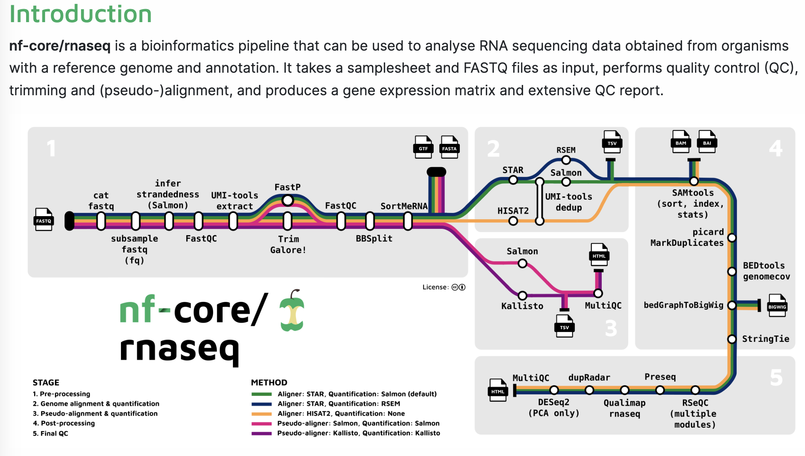

# Running a nf-core pipeline (RNA-Seq)

In this final practical, we will show you how to run a nf-core pipeline. nf-core set the standard for building gold standard, reproducible data pipelines, and have become the industry standard for processing RNA-Seq and other common "omics" data types.

They are made up of the efforts of the entire community, and are coordinated by a dedicated team at nf-core. For those beginning their bioinformatics journey, they are a super useful way to get the heavy lifting of bioinformatics done in an efficient way.

The example we will go through is the standard RNA-Seq pipeline which is located here: 

https://nf-co.re/rnaseq/3.14.0
 
 1. First go to nf-core rnaseq (above link), and try to understand what the pipeline is doing and what inputs the pipeline expects.

Cheat sheet

 

Hopefully you found that you require a genome (in fasta) and annotation (in gtf or gff3), as well as an input samplesheet that contains links to the raw RNA-Seq fastq data

 
2. Now we need to find the data and start building the samplesheet.csv file. The raw data are in `./data`. Can you build yourself a sample sheet with the data provided using their full paths.
 
 

Cheat sheet

 
sample,fastq_1,fastq_2,strandedness
CONTROL_REP1,AEG588A1_S1_L002_R1_001.fastq.gz,AEG588A1_S1_L002_R2_001.fastq.gz,auto
CONTROL_REP1,AEG588A1_S1_L003_R1_001.fastq.gz,AEG588A1_S1_L003_R2_001.fastq.gz,auto
CONTROL_REP1,AEG588A1_S1_L004_R1_001.fastq.gz,AEG588A1_S1_L004_R2_001.fastq.gz,auto

A sample sheet will contain a sample name, followed by the forward reads (normally R1), followed by the reverve reads (normally R2, if you have them)), followed by the strand information (if you want the pipeline to calculate this for you, you use auto, else you write unstranded, forward or reverse).

 
3. Download the genome and gff file to the data folder.

The genome and annotation are on a webpage, so we can use `wget` to download the genome and annotation, as follows:

`wget https://raw.githubusercontent.com/nf-core/test-datasets/7f1614baeb0ddf66e60be78c3d9fa55440465ac8/reference/genome.fasta`
 
`wget https://raw.githubusercontent.com/nf-core/test-datasets/7f1614baeb0ddf66e60be78c3d9fa55440465ac8/reference/genes.gff.gz`

 
4. Run the nf-core RNA-Seq pipeline on your input files. Read the online instructions of what you need to do to run the pipeline (found here: https://nf-co.re/rnaseq/3.14.0/docs/usage). Using your own paths to genome (--fasta), annotation (--gtf) and samplesheet (--input). 
 
 
You should use the --fasta /path/to/genome.fasta,  --gtf /path/to/genes.gff.gz and --input /path/to/samplesheet.csv

PLUS: you need to use the flag --profile docker . This is to ensure you are running from docker containers to pull all the programs you need to run nf-core rnaseq
 
 

Cheat sheet

 
You command should look like:

`nextflow run nf-core/rnaseq \` `
--input /workspace/training/eco-flow-training/mysamplesheet \` `--gtf /workspace/training/eco-flow-training/annotation.gtf \` `--fasta /workspace/training/eco-flow-training/genome.fasta`

 
5. You pipeline should now be working.

 

If it ends in an error, most likely you did not specify the correct paths to the three input files OR maybe you forgot to use the --profile docker flag. Raise a comment to the tutor if you are stuck at this stage. 
 

If your pipeline did succeed, you can wait for the pipeline to finish running and start exploring the output of the pipeline.

An overview of all the output types is found here: https://nf-co.re/rnaseq/3.14.0/docs/output. 

Spend 10 minutes exploring the output documentation, and by this time your pipeline run should have finished so you can then explore your own results. 
