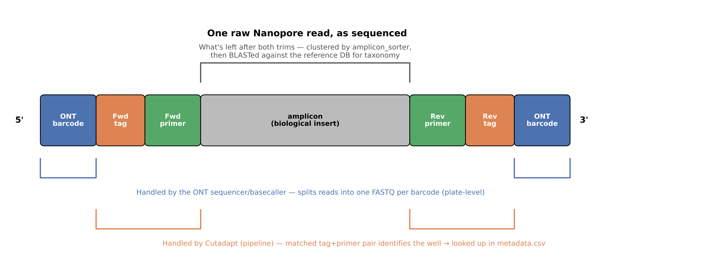

# Running the nanopore metabarcoding pipeline

🧭 [◀️ Part 2 · Pipelines](./pipelines.md) &nbsp;|&nbsp; [🏠 Course menu](../README.md)

---

🚀 **Start now:** [](https://codespaces.new/Eco-Flow/training) — *first launch takes a couple of minutes to build.*

⏱ **Estimated time:** ~60–90 minutes (including pipeline run time) &nbsp;•&nbsp; 🟡 Practical

In this practical you'll run **nanoporemetabarcoding**, a pipeline built by Eco-Flow ([`Eco-Flow/nanoporemetabarcoding`](https://github.com/Eco-Flow/nanoporemetabarcoding)) — from raw Nanopore reads all the way to a taxonomically-annotated ASV table.

> ℹ️ **Not an official nf-core pipeline.** nanoporemetabarcoding was scaffolded with the [nf-core](https://nf-co.re) template and follows its conventions (module structure, config profiles, `-profile docker`, etc.), which is why some of the tooling will feel familiar to Part 3 of this workshop. But it isn't part of the official nf-core pipeline collection, isn't listed on nf-co.re, and has no tagged release yet, as it is still in active development.

### What you'll do

- Understand what the nanopore metabarcoding pipeline is and how it works
- Inspect raw Nanopore reads
- Work out what inputs the pipeline needs
- **Design** a samplesheet and metadata sheet for a real experimental scenario
- **Run** the pipeline on its built-in test data with Docker containers
- Explore the results — quality reports, BLAST hits, taxonomy, and a community matrix
- **Run** the pipeline on an HPC cluster, using UCL's Myriad as a worked example

### The experiment

We'll use a case study to motivate the design steps: **DNA barcoding of adult wasps to identify their prey.**

6 wasps in total were collected at two sites: 3 wasps in oak woodland and 3 in grassland. Each wasp's gut was individually DNA-barcoded (COI) using primers that target that region and prevent host DNA amplification (`WaspExF_*` forward / `LuthienR_*` reverse) to profile its host's diet signature.

For each site, we also included a few **controls**: an **extraction blank** (no tissue — just reagents, to catch contamination introduced during DNA extraction), a **PCR blank** (water instead of DNA, to catch contamination introduced during PCR/tagging), and a **positive control** (DNA from a known reference species, to confirm the assay actually works).

| Site | Description |
| --- | --- |
| Site A ("Woodland") | Adult wasps collected in oak/hazel woodland |
| Site B ("Grassland") | Adult wasps collected in grassland |

Each site's wasps and controls were laid out on a physical multi-well plate — one **well** per wasp or control — and it's the well's tag combination that a read gets traced back to. Here's the whole journey from collection to the raw FASTQs you'll actually work with, including both demultiplexing steps:


Barcoded DNA from all wasps and both sites were pooled together onto a **single, shared sequencing run**. Each site gets its own **Nanopore barcode** (a run-level ID, resolved automatically by the sequencer) — and within each site, individual wasps and controls are told apart by **tags** (a finer-grained ID, resolved by the pipeline itself). You'll build the exact plate layout, samplesheet, and metadata for this scenario yourself in Steps 2–3, then **run** the pipeline for real in Step 4 using the small dummy dataset.

---

## Step 0 — Pipeline overview

Before diving in, here's the whole journey from raw reads to results in one picture — every stage you'll actually see running in Step 4:


- Raw Nanopore reads (one FASTQ per plate, already split by barcode)
- **NanoFilt** → filter reads by length/quality
- **NanoPlot** → QC report, before and after filtering, and after demultiplexing
- **Cutadapt** (×2) → demultiplex by forward tag, then reverse tag → one file per well
- **amplicon_sorter** → cluster each well's reads into consensus sequence(s)
- **Medaka** → polish each consensus
- **BLAST** → search each consensus against your reference database
- **taxonomizr** → assign taxonomy from the best BLAST hit

<details>
<summary>📚 Good background resources</summary>

- [Nanopore sequencing — how it works (Oxford Nanopore)](https://nanoporetech.com/how-it-works)
- [Cutadapt documentation](https://cutadapt.readthedocs.io/) — the demultiplexing tool this pipeline uses
</details>

---

## Step 1 — Inspect the raw data and pipeline requirements

The pipeline ships with a small built-in test dataset, but we will use a custom one made for this training, following the case study above. Clone the pipeline repository first:

```bash
git clone https://github.com/Eco-Flow/nanoporemetabarcoding.git
cd nanoporemetabarcoding
```

What is `git clone`? `git clone` downloads a full copy of a repository from GitHub (or another code host) onto your machine. You'll usually need this step to run a pipeline that isn't on nf-core — nf-core pipelines can be run directly by name (`nextflow run nf-core/...`), since Nextflow fetches them for you automatically.

The raw reads live in `wasp_test_data/`. Nanopore FASTQs are gzipped, so peek at them with `zcat`:

> ▶️ **Try it — peek at a raw FASTQ**
>
> ```bash
> zcat wasp_test_data/barcode01.fastq.gz | head -8
> ```
>
> <details>
> <summary>✅ Expected output</summary>
>
> Groups of four lines per read, same FASTQ format as Illumina — but unlike the paired, fixed-length RNA-Seq reads from Part 3, Nanopore reads are **single, variable-length long reads** with no pair:
>
> ```
> @<read id> ...
> ATGCGT...(a few hundred bp, length varies read to read)
> +
> !%'&&$#"...(quality string, same length as the sequence)
> ```
> </details>

> ▶️ **Try it — count the reads**
>
> ```bash
> zcat wasp_test_data/barcode01.fastq.gz | wc -l
> ```
>
> FASTQ uses **4 lines per read**, so divide the line count by 4 to get the number of reads. This file is deliberately tiny (a handful of reads per well) so the whole pipeline runs in minutes.

Also inspect the other files you'll need:

```bash
cat wasp_test_data/tag-primer_f.fasta      # forward tag-primer sequences
cat wasp_test_data/tag-primer_r.fasta      # reverse tag-primer sequences
cat wasp_test_data/metadata.csv         # which tag combination = which sample
```

Now that you've seen the files, check the pipeline's own usage on its GitHub page — [`README.md`](https://github.com/Eco-Flow/nanoporemetabarcoding/blob/master/README.md) — to see how they map to actual inputs.

To run nanoporemetabarcoding you need:

* a **samplesheet** (`--input`) — one row per FASTQ. For this experiment, every FASTQ represents one Nanopore barcode/plate
* *(optional)* a **metadata** sheet (`--metadata`) — one row per well, mapping a forward+reverse tag-primer combination to a sample name. Without it, wells are reported under their raw tag-primer combination instead of a human-readable sample name — worth having for any experiment with more than a couple of wells per plate
* a **forward tag-primer FASTA** (`--tags_f`) and a **reverse tag-primer FASTA** (`--tags_r`). This are needed for demultiplexing
* a **reference database** for taxonomy — either `--blast_db` (pre-built) or `--custom_db` (a FASTA the pipeline will build a BLAST DB from). For this workshop we are going to use a custom one, as a BLAST database can be hundreads of gigabytes in size
* a **taxonomy ID database** (`--sql_db`) — a separate `taxonomizr` SQLite file that maps each BLAST hit's accession to its full taxonomic lineage (domain → species). `--custom_db`/`--blast_db` only supply the sequences to search *against*; this is what turns the winning accession into an actual species name afterward

---

## Step 2 — Design a samplesheet

The **samplesheet** links each FASTQ to an ID. It has just two columns:

| Column | Meaning |
| --- | --- |
| `id` | An identifier you choose for the FASTQ (can be anyrhing, but cannot contain spaces or '_') |
| `fastq` | Path to that ID's single, merged FASTQ file |

> ▶️ **Try it — design `samplesheet.csv` for the wasp experiment**
> Using the table in [The experiment](#the-experiment) (2 sites → 2 plates → 2 barcodes), write out what the samplesheet should look like.

<details>
<summary>Cheat sheet — samplesheet.csv for the wasp scenario</summary>

```csv
id,fastq
woodland,wasp_test_data/barcode01/woodland_combined.fastq.gz
grassland,wasp_test_data/barcode02/grassland_combined.fastq.gz
```

One row per ONT barcode/plate. `fastq` must point to a single, existing `.fastq.gz` file — if your sequencer produced several chunk files per barcode, merge them (e.g. `cat`) before writing the samplesheet.
</details>

---

## Step 3 — tag-primer FASTAs and metadata

First, what a **tag-primer FASTA** actually is: a regular FASTA file where:

- the **header** is a short label for that **sequence** (in the case of this study, it's a combination of the tag and the primer's original tables, but it can be anything).
- the **sequence** is the tag fused to the primer — the exact DNA Cutadapt searches for and trims off each read during demultiplexing (Step 0)

You need two: one for the forward tags (`--tags_f`) and one for the reverse tags (`--tags_r`). A read matching one entry from each file, forward and reverse, is what identifies which well it came from.

Here's that whole chain, end to end, for one real read from the woodland plate (`WD_wasp01`, well F2×R1):



- A raw read looks like: `[forward tag+primer]` — biological insert — `[revcomp of reverse tag+primer]`
- Cutadapt strips the forward end using `tag-primer_f.fasta`, and records which header matched → `F2_WaspExF_Tab2`
- Cutadapt strips the reverse end using `tag-primer_r.fasta`, and records which header matched → `R1_LuthienR_Tab29`
- Those two headers get joined into one string → `F2_WaspExF_Tab2_R1_LuthienR_Tab29` — this is the well's `tag-primer_comb`
- The pipeline looks that exact string up in `metadata.csv`'s `tag-primer_comb` column → finds the matching sample name → **`WD_wasp01`**

That's also exactly why the ⚠️ key rule below matters — every link in that chain is a plain string match, so one typo anywhere breaks it.

The **metadata** sheet is optional — but it's what resolves each demultiplexed well down to a sample name; skip it and the pipeline reports each well under its raw tag-primer combination instead. You build it by mapping every tag-primer combination (using the same FASTA headers from above) to the sample it belongs to. It has three columns:

| Column | Meaning |
| --- | --- |
| `id` | Must match a plate `id` from the samplesheet |
| `tag-primer_comb` | `<forward tag header>_<reverse tag header>` — must exactly match headers in your `tag-primer_f`/`tag-primer_r` FASTAs, and every combination must be separated by a `_` |
| `sample` | The name you want in the final ASV table — must be **unique within each plate** |

> ⚠️ **Key rule:** `tag-primer_comb` is a straight string match against your FASTA headers. If the tag names don't match exactly (typos, case, extra characters), that well's reads won't be assigned to a sample.

> ▶️ **Try it — design the metadata for the woodland plate**
>
> The woodland plate has 3 forward tags (`F1_WaspExF_Tab1`, `F2_WaspExF_Tab2`, `F3_WaspExF_Tab3`) and 2 reverse tags (`R1_LuthienR_Tab29`, `R2_LuthienR_Tab54`), giving 6 wells: one extraction blank, one positive control, one PCR blank, and 3 adult wasps netted in the Woodland site. Write out the FASTAs and the metadata rows.

<details>
<summary>Cheat sheet — tag-primer_f.fasta / tag-primer_r.fasta</summary>

```fasta
>F1_WaspExF_Tab1
AACAAGCCCCTTTATCWTSWRRWWTTGS
>F2_WaspExF_Tab2
GGAATGAGTCCTTTATCWTSWRRWWTTGS
>F3_WaspExF_Tab3
AATTGCCGGTCCTTTATCWTSWRRWWTTGS
```

```fasta
>R1_LuthienR_Tab29
GAGTAACCACTTCWGGRTGWCCAAARAAYCA
>R2_LuthienR_Tab54
CGATGAGTTACTTCWGGRTGWCCAAARAAYCA
```
</details>

<details>
<summary>Cheat sheet — metadata.csv for the woodland plate</summary>

```csv
id,primer_comb,sample
woodland,F1_WaspExF_Tab1_R1_LuthienR_Tab29,EXT_NEG_F1_R1
woodland,F2_WaspExF_Tab2_R1_LuthienR_Tab29,WD_wasp01
woodland,F3_WaspExF_Tab3_R1_LuthienR_Tab29,WD_wasp02
woodland,F1_WaspExF_Tab1_R2_LuthienR_Tab54,WD_wasp03
woodland,F2_WaspExF_Tab2_R2_LuthienR_Tab54,POS_CON_F2_R2
woodland,F3_WaspExF_Tab3_R2_LuthienR_Tab54,BLANK_F3_R2
```

Same mapping, laid out as a plate layout:

**woodland plate (`barcode01`)**

|  | `R1_LuthienR_Tab29` | `R2_LuthienR_Tab54` |
| --- | --- | --- |
| `F1_WaspExF_Tab1` | `EXT_NEG_F1_R1` *(extraction blank)* | `WD_wasp03` |
| `F2_WaspExF_Tab2` | `WD_wasp01` | `POS_CON_F2_R2` *(positive control)* |
| `F3_WaspExF_Tab3` | `WD_wasp02` | `BLANK_F3_R2` *(PCR blank)* |
</details>

> ▶️ **Try it — design the metadata for the grassland plate**
>
> The grassland plate reuses the same forward/reverse tag scheme as the woodland plate (the same primer plate design was run at both sites), so you already have every header ID you need — no need to open the FASTA files again. Work straight from the plate layout below: the row/column labels give you the tag headers, and each cell gives you the sample that goes with that combination.
>
> **grassland plate (`barcode02`)**
>
> |  | `R1_LuthienR_Tab29` | `R2_LuthienR_Tab54` |
> | --- | --- | --- |
> | `F1_WaspExF_Tab1` | `EXT_NEG_F1_R1` *(extraction blank)* | `GL_wasp03` |
> | `F2_WaspExF_Tab2` | `GL_wasp01` | `POS_CON_F2_R2` *(positive control)* |
> | `F3_WaspExF_Tab3` | `GL_wasp02` | `BLANK_F3_R2` *(PCR blank)* |

<details>
<summary>Cheat sheet — metadata.csv for the grassland plate</summary>

```csv
id,primer_comb,sample
grassland,F1_WaspExF_Tab1_R1_LuthienR_Tab29,EXT_NEG_F1_R1
grassland,F2_WaspExF_Tab2_R1_LuthienR_Tab29,GL_wasp01
grassland,F3_WaspExF_Tab3_R1_LuthienR_Tab29,GL_wasp02
grassland,F1_WaspExF_Tab1_R2_LuthienR_Tab54,GL_wasp03
grassland,F2_WaspExF_Tab2_R2_LuthienR_Tab54,POS_CON_F2_R2
grassland,F3_WaspExF_Tab3_R2_LuthienR_Tab54,BLANK_F3_R2
```
</details>

> 💡 **Always include controls.** `EXT_NEG` (extraction blank — no tissue), `POS_CON` (mock DNA of a known reference species), and `BLANK` (PCR no-template control) are how you catch contamination and confirm the assay worked — track them through the metadata sheet exactly like a real sample.

---

## Step 4 — Run the pipeline

Now put the theory aside and actually run the pipeline:

Read the parameters block in [`nextflow.config`](https://github.com/Eco-Flow/nanoporemetabarcoding/blob/master/nextflow.config) for the full option list.

<details>
<summary>Cheat sheet — the full command</summary>

```bash
nextflow run main.nf \
-profile docker \
--input conf/samplesheet.csv \
--metadata wasp_test_data/metadata.csv \
--tags_f wasp_test_data/tag-primer_f.fasta \
--tags_r wasp_test_data/tag-primer_r.fasta \
--custom_db wasp_test_data/custom_db.fasta \
```

</details>

> 👉 **Single vs double dashes matter!** A single dash (`-profile`, `-resume`) is a **Nextflow** core option. A double dash (`--input`, `--metadata`, `--outdir`) is a **pipeline** parameter defined by nanoporemetabarcoding.

> ✅ **What success looks like:** Nextflow prints a banner, then a live list of processes as they run (`NANOFILT`, `NANOPLOT`, `CUTADAPT` ×2, `AMPLICON_SORTER`, `MEDAKA`, `BLAST_BLASTN`, `ASSIGN_TAXA`, ...). On the tiny test data this should complete in a few minutes, plus a bit longer the first time while Docker pulls the containers.

### Troubleshooting Step 4

<details>
<summary>❌ <code>Missing required parameter: --input</code> / <code>--outdir</code></summary>

Check every `--input`, `--metadata`, `--tags_f`, `--tags_r` and `--outdir` is present and spelled correctly.
</details>

<details>
<summary>❌ A well/sample is missing from the final ASV table</summary>

Almost always a `primer_comb` mismatch — the tag combination in `metadata.csv` doesn't exactly match `<tags_f header>_<tags_r header>`. Double-check spelling and case.
</details>

<details>
<summary>❌ <code>.command.sh: ... command not found</code> (exit status 127)</summary>

You forgot **`-profile docker`**. Without it, Nextflow expects every tool (Cutadapt, Medaka, BLAST, ...) to already be installed locally.
</details>

---

## Step 5 — Explore the results

Once you see `Pipeline completed successfully`, look inside `results/`:

```bash
ls results
```

<details>
<summary>✅ Roughly what you'll see</summary>

```
nanoplot/  blast/  assign_taxa/  community_matrix/  plots/  multiqc/  pipeline_info/  reads_per_step/
```
</details>

**Where to look, in order:**

1. **`multiqc/multiqc_report.html`** — one HTML report summarising QC across all samples (built from NanoStat).
2. **`nanoplot/demultiplexed/<plate>/`** — per-plate read-length/quality plots, generated *after* demultiplexing, so you can sanity-check each well individually.
3. **`reads_per_step/reads_per_step.csv`** — a read-count funnel: how many reads survived filtering, then each demultiplexing step. This is the fastest way to spot a well that dropped to zero reads (usually a `primer_comb` typo).
4. **`blast/<plate>.txt`** — raw BLAST hits for every consensus sequence.
5. **`assign_taxa/<plate>/ASV_table_final.csv`** — the key output: one row per ASV (consensus sequence) per well, with its assigned taxonomy from the best BLAST hit.
<!--6. **`community_matrix/<plate>/<plate>_abundance.csv`** and **`..._presence_absence.csv`** — the ASV table pivoted into a classic samples × taxa community matrix, ready for ecological analysis (diversity indices, ordination, etc.).-->
6. **`plots/proportion/*.png`** — stacked bar plots of taxonomic composition per barcode, at each rank listed in `--tax_list`.

> 🧬 **If you completed Step 3:** open `assign_taxa/.../ASV_table_final.csv` and check whether `EXT_NEG` and `BLANK` picked up any real hits — if they did, that's contamination worth flagging, exactly as it would be in a real run.

---

## Step 6 — Running on an HPC (Myriad example)

> 🎯 For the general concepts (talking to your HPC admin, writing a config from scratch, testing it) see the bonus **[Running a pipeline on an HPC](./hpc.md)** — this step is a concrete worked example on top of that, using UCL's **Myriad** cluster.

Because nanoporemetabarcoding was build from the nf-core template, it inherits nf-core's **institutional config** mechanism — so if your institution already has a config, you don't write anything yourself. Browse **[nf-co.re/configs](https://nf-co.re/configs/)** to check — UCL's Myriad cluster is listed there.

> ⚠️ **Before you run anything, follow the setup steps on your cluster's own config page** — e.g. for Myriad that's **[nf-co.re/configs/ucl_myriad](https://nf-co.re/configs/ucl_myriad/)**. Each institution's page documents cluster-specific prerequisites — for Myriad that means loading a specific Java module (`module load java/temurin-17/17.0.2_8`, added to your `.bashrc`) and installing Nextflow itself into your own `~/bin/`, since it's not preinstalled.

```bash
nextflow run main.nf -profile test_synth,ucl_myriad --outdir results -resume -bg -w ./Scratch > log
```

Myriad's cluster uses singulairty to manage dependecines. You can use conda instead if singulairty is not installed in your HPC.

> 👉 **`-w`** sets Nextflow's **work directory** (defaults to `./work`) — where every task's intermediate files are staged, and what both Nextflow's caching and `-resume` (Step 7) rely on: delete or move it, and there's nothing left to resume from. On an HPC it's worth choosing this deliberately before a real run, since these files can get large fast — point it at your cluster's **scratch** space rather than your home directory, to avoid filling shared storage.

> 💡 **What is Singularity?** Docker needs a background daemon running with root privileges — not something shared HPC systems can safely allow every user to have. **Singularity** (**Apptainer** is another equivalent option) is a container engine built for exactly this situation: it runs the same kind of containers as Docker, but as your own user account, with no daemon and no elevated privileges required. That's why HPC configs use `-profile singularity` instead of `-profile docker` — it's not a style choice, it's usually the only container engine installed in most cluster.

`-profile ucl_myriad` downloads and applies [`ucl_myriad.config`](https://github.com/nf-core/configs/blob/master/conf/ucl_myriad.config) automatically — no `-c` flag, and no separate `-profile singularity` needed (the profile enables Singularity itself). It's worth reading the actual config to see what a real one looks like:

<details>
<summary>What's actually in ucl_myriad.config</summary>

```groovy
executor {
    name = 'sge'
    queueSize = 100
    submitRateLimit = '10/1s'
}

process {
    penv = 'smp'
    clusterOptions = {
        def mem = task.memory.mega
        def cpus = task.cpus
        def memoryPerCpu = mem/cpus
        "-S /bin/bash -l mem=${memoryPerCpu}M "
    }
}

singularity {
    enabled  = true
    cacheDir = "${System.getenv('HOME')}/Scratch/.apptainer/pull"
}
```

Two things worth noticing, since they're easy to get wrong writing your own config:

- **Myriad uses SGE**, whose `-l mem=` flag is **memory per core, not per job** — so the config computes `task.memory / task.cpus` on the fly for every process, rather than using a single fixed value.
- The **Singularity cache** (`cacheDir`) is pointed at `~/Scratch`, not the home directory — home quotas on Myriad are small, and containers are large. Always check where your own cluster wants large/scratch data to live (Step 1 in [hpc.md](./hpc.md)). This is usally the case for most HPCs.
</details>

> ▶️ **Try it — test the config before a real run**
>
> ```bash
> nextflow run main.nf -profile test_synth,my_hpc_config --outdir results
> ```
> Same idea as Step 6 of [hpc.md](./hpc.md): run the tiny test profile first and check the banner says `executor >  sge`, not `executor >  local` — that confirms jobs are actually going to the scheduler, not running on the login node.

While jobs are running, watch them with `qstat` on SGE — the same command [hpc.md](./hpc.md) points to for Slurm's `squeue`. Both print a status column whose codes mean the same underlying thing but look different:

| Meaning | `qstat` (SGE/Myriad) | `squeue` (Slurm) |
| --- | --- | --- |
| Running | `r` | `R` |
| Queued, waiting for resources | `qw` | `PD` |
| Held (won't start — e.g. a dependency isn't met) | `hqw` | `PD` *(reason shown separately, e.g. `Dependency`)* |
| Finishing up / cleaning after the job ends | `t` (transferring) | `CG` (completing) |
| Completed successfully | *(drops off `qstat` entirely — check with `qacct -j <jobid>`)* | `CD`, briefly, then drops — check history with `sacct -j <jobid>` |
| Failed to start (config/resource error) | `Eqw` | `F` |
| Hit its time limit | *(job is killed; check `qacct -j <jobid>`)* | `TO` |
| Suspended | `s` / `S` | `S` |
| Being cancelled/deleted | `dr` / `dt` | `CA` |

> 🔍 **`Eqw` is the one you'll actually hit while debugging a config.** It means the job was rejected before it even started — almost always a bad `clusterOptions`/`penv`/queue name. Run `qstat -j <jobid>` (SGE) or `scontrol show job <jobid>` (Slurm) to see *why* it was rejected, rather than just that it was.

<!--
In some HPCs, running Nextflow directly from the login node is not recommended (contact your HPC admin for more information). In that case, submit your Nextflow command it as its own SGE (or slurm, if that is your HPC scheduler) job rather than running it directly in your terminal:

<details>
<summary>Cheat sheet — <code>run_nanopore_myriad.sh</code> (submit with <code>qsub run_nanopore_myriad.sh</code>)</summary>

```bash
#!/bin/bash -l
#$ -l h_rt=4:00:0
#$ -l mem=4G
#$ -N nanoporemetabarcoding

module load java/temurin-17/17.0.2_8

nextflow run main.nf \
  -profile ucl_myriad \
  --input wasp_test_data/samplesheet.csv \
  --metadata wasp_test_data/metadata.csv \
  --tags_f wasp_test_data/tag-primer_f.fasta \
  --tags_r wasp_test_data/tag-primer_r.fasta \
  --custom_db wasp_test_data/custom_db.fasta \
  --outdir my_results \
  -resume
```

The `-l mem=4G` / `-l h_rt=4:00:0` here are for the **driver job only** (Nextflow itself is light) — the actual pipeline steps get their own resources per-process from `ucl_myriad.config`, submitted as separate SGE jobs by Nextflow.
</details>
-->

> 💡 **Other schedulers (Slurm, etc.):** the same institutional-profile trick applies wherever nf-core/configs has a listed cluster — check https://nf-co.re/configs first. If yours isn't listed, [hpc.md](./hpc.md) has side-by-side minimal config examples for both **SGE** and **Slurm**: the main differences are `executor.name` (`'sge'` vs `'slurm'`), how you request memory (SGE: per-core via `clusterOptions`; Slurm: per-job via `--mem`), and the queue/partition option name. A Slurm submission script for this same pipeline would look like `hpc.md`'s own Slurm example, swapping in nanoporemetabarcoding's `--input`/`--metadata`/`--tags_f`/`--tags_r`/`--custom_db` flags shown above.

> 🙋 **No institutional config for your cluster?** Just get your HPC admin in touch with us at Eco-Flow and we will build one.

---

## Step 7 — Resuming a run and changing options

### Changing an option

Taxonomy assignment has adjustable identity thresholds per rank — e.g. `--spident` (species), `--gpident` (genus). Work out how you'd tighten the species-level threshold to 98% identity, but **don't run it yet**:

<details>
<summary>Answer — the modified command</summary>

```bash
nextflow run main.nf \
-profile test,docker \
--outdir my_results \
--spident 98
```
</details>

### The `-resume` flag

Add **`-resume`** and Nextflow reuses cached results for any step whose inputs haven't changed — so re-running the command above only re-executes taxonomy assignment (and anything downstream of it), not the demultiplexing or clustering steps.

> ✅ **What you'll see with `-resume`:** unchanged processes marked `cached`, e.g. `[a1/b2c3] ...:CUTADAPT_FORWARD (woodland) [100%] 1 of 1, cached: 1 ✔`.

---

## Finish

🎉 **You've finished this practical.** You've gone from raw Nanopore reads to a taxonomically-annotated, per-sample ASV table and community matrix — and designed a samplesheet/metadata scheme for a real multi-plate, primer-tagged experiment.

**Next steps:**

- Adapt what you designed in Steps 2–3 to your **own** primer-tag scheme and run it on your own data.
- Explore the full parameter list in [`nextflow.config`](https://github.com/Eco-Flow/nanoporemetabarcoding/blob/master/nextflow.config) — worth tuning per-rank identity thresholds (`--spident`/`--gpident`/`--fpident`/`--opident`) and `--tax_list` for your own taxonomic group.
- Running on a cluster other than Myriad? Step 6 above covers the concrete example; the bonus **[Running a pipeline on an HPC](./hpc.md)** covers the general concepts (including a Slurm walkthrough).

---

🧭 [◀️ Part 2 · Pipelines](./pipelines.md) &nbsp;|&nbsp; [🏠 Course menu](../README.md)
