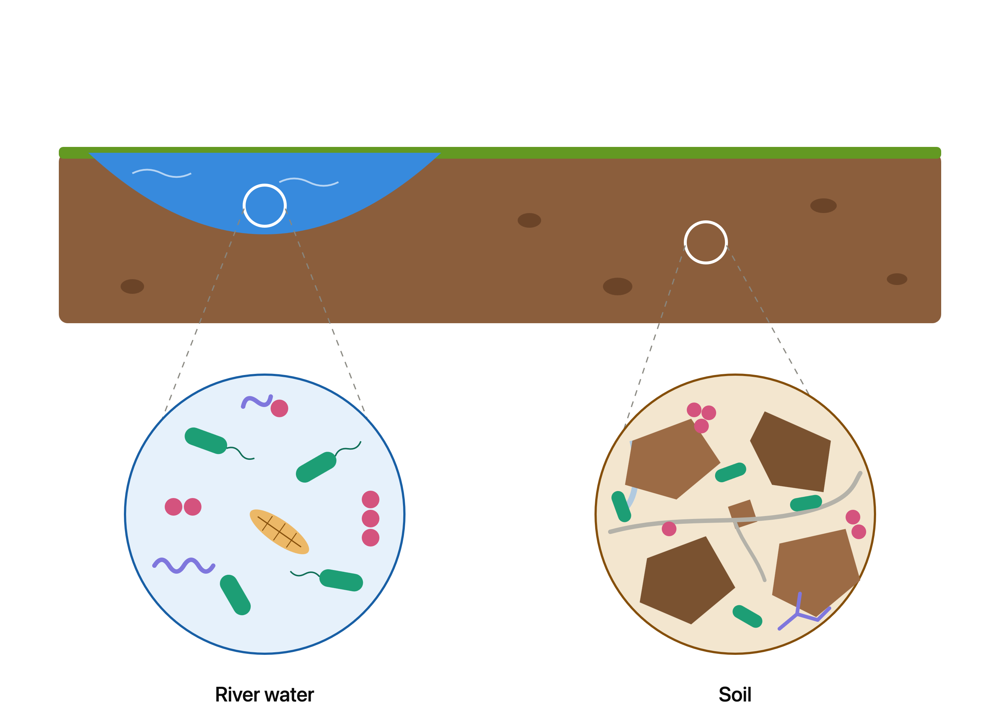
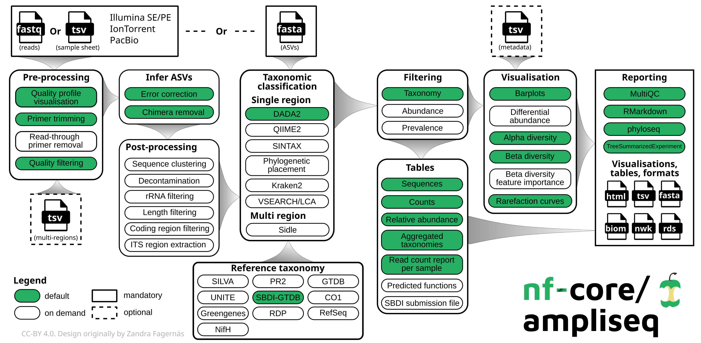

# Running an nf-core ampliseq (amplicon sequencing)

🧭 [◀️ Part 4 · Differential expression](./differential.md) &nbsp;|&nbsp; [🏠 Course menu](../README.md) &nbsp;|&nbsp; **Next:** [Part 6 · Nanopore metabarcoding ▶️](./nanopore_metabarcoding.md)

🚀 **Start now:** [](https://codespaces.new/Eco-Flow/training) — *first launch takes a couple of minutes to build.*

---

⏱ **Estimated time:** ~60–90 minutes (including pipeline run time) &nbsp;•&nbsp; 🟡 Practical

In this practical you'll run the **nf-core ampliseq pipeline** ([nf-core/ampliseq](https://nf-co.re/ampliseq/2.18.0)) on example data — from raw sequencing reads all the way to a gene-count table and a quality report. **nf-core/ampliseq** is a bioinformatics pipeline used for amplicon sequencing, supporting:

-  **QC** and **primer trimming**.
-  **Amplicon denoising** (error-correction). Via DADA2 or QIIME2.
-  **Taxonomic classification**. Using a reference database (e.g. SILVA, UNITE, GTB), via DADA2 or QIIME2
-  **Downstream analysis**. Diversity stats, plots, abundance tables.
-  **Reporting**. MultiQC summary plus QIIME2 visualizations (`.qzv` files).


### What you'll do

- Inspect the raw amplicon sequencing data
- Work out what inputs the pipeline needs
- Build a **samplesheet** describing your samples
- Build a **sample metadata** for downstream analysis
- Download a reference **database!!!?????**
- **Run** the pipeline with Docker containers
- Explore the **results** (quality reports and abundance tables)
- Learn to **`-resume`** a run and change pipeline options

> ✅ **Before you start**, make sure you've completed [Setup](./setup.md) and that your terminal is inside the **`eco-flow-training`** folder. Check with:
> ```bash
> pwd     # should end in eco-flow-training
> ```
> Everything below assumes you run commands from there. In Codespaces the full path is `/workspaces/training/eco-flow-training`; on a local machine substitute your own path (use `pwd` to see it).

### The experiment

We'll compare soil and river samples. DNA was extracted from both sites, and amplicon sequencing was performed targeting the 16S rRNA V4 region for microbiome profiling, and comparison between sites. There are 2 replicates of each site:



| Sample | Habitat | Reads |
| --- | --- | --- |
| SRR10070130 | River water | paired-end (`_1` + `_2`) |
| SRR10070131 | River water | paired-end (`_1` + `_2`) |
| SRR10102392 | Soil | paired-end (`_1` + `_2`) |
| SRR10102393 | Soil | paired-end (`_1` + `_2`) |

Like mentioned, the primers for this course target the 16S rRNA V4 region, using the standard Earth Microbiome Project primer pair:

| Sequence | Target |
| --- | --- |
| `GTGYCAGCMGCCGCGGTAA` | 16S rRNA V4, forward (515F) |
| `GGACTACNVGGGTWTCTAAT` | 16S rRNA V4, reverse (806R) |

This is of course not a good experiment design, its purpose is to give the sequences some context.

---

## Step 0 — Understand amplicon sequencing

Before running the amplicon sequencing pipeline, it helps to understand what amplicon sequencing is. In short: amplicon sequencing is a targeted sequencing method that uses PCR to amplify specific genomic regions of interest (e.g., CO1, 16S/18S, ITS) instead of the entire genome.

It results in libraries of sequences called **reads**, stored in **FASTQ format**. Depending on the sequencing technology used, reads can be single-end (one FASTQ per sample) or paired-end (two FASTQs per sample). We are going to explore and learn more about this format in the next section.

---

## Step 1 — Inspect the raw data

It's always worth looking at your data before running anything. The reads in FASTQ format live in the `ampliseq_data` folder.

The FASTQ files are compressed with `gzip` (they end in `.gz`), so they aren't directly human-readable — plain `cat`/`head` would print gibberish (don't panic if you see `<��xT�r-�B7�...`, that's expected!). Instead, use **`zcat`** (from Part 1), which reads gzipped files.

> 🍎 **On a Mac?** In Codespaces (Linux) `zcat` reads `.gz` files directly. macOS's `zcat` is different — it expects a `.Z` file and will error on `.gz`. If you're following along locally on a Mac, use **`gzcat`** (or `gunzip -c`) everywhere this page says `zcat`.

> ▶️ **Challenge — inspect a FASTQ file**
>
> Try to answer these two questions from the data:
>
> 1. How many lines are in the FASTQ file?
> 2. What is the length of the reads?
>
> Use these commands:
>
> ```bash
> zcat ampliseq_data/SRR10070130_1.fastq.gz | wc -l
> zcat ampliseq_data/SRR10070130_1.fastq.gz | head -n 2 | tail -n 1 | tr -d '\n' | wc -c
> ```
>
> <details>
> <summary>✅ Answer</summary>
>
> ```
> 12000
> 250
> ```
>
> The first command shows there are `200000` lines in the file. A FASTQ record uses **4 lines per read**, so that corresponds to `50000` reads. The second command uses `head` and `tail` to grab the second line of the file, which is the first read sequence, and `wc -c` counts the number of characters in it. We add `tr -d '\n'` to strip the trailing newline first — without it, `wc -c` would also count the line break and report `102`. So the reads are `101` bases long. There are many ways to do this, and even copying the file into an editor and looking at it manually is fine.
> </details>

### Structure of a typical FASTQ file

Each read in a FASTQ file is stored as four lines:

1. **Header line** — starts with `@` and contains the read identifier.
2. **Sequence line** — the DNA or RNA bases for that read.
3. **Separator line** — a single `+`, often followed by the same read identifier.
4. **Quality line** — one character of quality score per base, usually in ASCII.

For example:

```text
@SRR6357070.1 1/1
GATCGGAAGAGCACACGTCTGAACTCCAGTCAC...
+
AAAAEEEEEEEEEEEEEEEEEEEEEEEEEEEE...
```

This layout is important because it lets the pipeline keep the sequence and its quality information together for every read.

---

## Step 2 — Explore the pipeline's requirements

Go to the nf-core/ampliseq page and read what the pipeline does and what inputs it expects: 👉 **https://nf-co.re/ampliseq/2.18.0**



<details>
<summary>Cheat sheet — what the pipeline needs</summary>

To run nf-core/ampliseq you need:

* an **input samplesheet** (CSV) that links to your raw RNA-Seq FASTQ data - MANDATORY
* an **input metadata** (CSV) wuth information about your samples - OPTIONAL
* **Forward** and **Reverse** primers used during PCR amplification - OPTIONAL

Samples are linked between the two files via the samplesheet's `sample` column and the metadata's `ID` column - their values must match.
</details>

---

## Step 3 — Build the samplesheet

The **samplesheet** is a CSV file that tells the pipeline which files belong to which sample. Create a file called `samplesheet.csv` in the `eco-flow-training` folder (e.g. with `nano samplesheet.csv`).

It has four columns:

| Column | Meaning |
| --- | --- |
| `sample` | A name you choose for the sample (must match across replicates you want grouped) |
| `fastq_1` | Full path to the forward reads (R1) |
| `fastq_2` | Full path to the reverse reads (R2) — **leave empty for single-end** samples |

> ⚠️ **Paired vs single-end:** all samples here a paired-end, but the samplesheet can also accepts single-end samples. If the sample is single-end, fill `fastq_1`, leave `fastq_2` blank — note the trailing comma.

Try to build the samplesheet yourself using the [example on the nf-core page](https://nf-co.re/ampliseq/2.18.0/docs/usage/#sample-sheet-input) as a guide to build the 2 river water and 2 soil samples, then compare with the cheat sheet.

<details>
<summary>Cheat sheet — full samplesheet.csv</summary>

```csv
sample,fastq_1,fastq_2
SRR10070130,/workspaces/training/eco-flow-training/ampliseq_data/SRR10070130_1.fastq.gz,/workspaces/training/eco-flow-training/data/SRR10070130_2.fastq.gz
SRR10070131,/workspaces/training/eco-flow-training/ampliseq_data/SRR10070131_1.fastq.gz,/workspaces/training/eco-flow-training/data/SRR10070131_2.fastq.gz
SRR10102392,/workspaces/training/eco-flow-training/ampliseq_data/SRR10102392_1.fastq.gz,/workspaces/training/eco-flow-training/data/SRR10102392_2.fastq.gz
SRR10102393,/workspaces/training/eco-flow-training/ampliseq_data/SRR10102393_1.fastq.gz,/workspaces/training/eco-flow-training/data/SRR10102393_2.fastq.gz
```

The `sample` values are the raw SRR accessions, but they can be any other string, as long as they are unique per row and match the metadata file's `ID` column (Step 2).
</details>

> 💡 **Using absolute paths is highly recommended.** The paths above are the Codespaces location. On a local machine, replace `/workspaces/training/eco-flow-training` with the output of your own `pwd`.

## Step 4 - Build the sample metadata

The **sample metadata** is a CSV file that gives information about the samples for the downstream analysis (barplots, diversity indices, and differential abundance testing).  It must follow the QIIME2 specifications. It's optional, but if it's not provided, the pipeline will skip the downstream analyses.

Create a file called `metadata.csv` in the `eco-flow-training` folder (e.g. with `nano metadata.csv`).

It has four columns:

| Column | Meaning |
| --- | --- |
| `ID` | A name you choose for the sample (must match the `sample` column from the `samplesheet.csv`) |
| `any_other_columns` | Any name, any number. Used as grouping variables for downstream stats (barplots, diversity, differential abundance). For the current course, we are going to focus on a single column |

Try to build the sample metadata yourself using the [example on the nf-core page](https://nf-co.re/ampliseq/2.18.0/docs/usage/#metadata) as a guide to build the 2 river water and 2 soil samples, then compare with the cheat sheet. You can name the grouping column `habitat`, as we did in the table above.

<details>
<summary>Cheat sheet — full metadata.csv</summary>

```csv
ID,habitat
SRR10070130,River water
SRR10070131,River water
SRR10102392,Soil
SRR10102393,Soil
```

The `ID` values are the raw SRR accessions — they must match the `sample` column from `samplesheet.csv` exactly. `habitat` is the grouping column we chose, with repeated (but not all-unique) values so QIIME2 can use it for downstream comparisons.
</details>

## Step 5 — Run the pipeline

Now run nf-core/ampliseq using this pipeline specific flags:
-  samplesheet (`--input`)
-  sample metadata (`--metadata`)
-  forward primers (`--FW_primer`)
-  reverse primers (`--RV_primer`)
-  output directory name (`--outdir`, choose anything).

Read the official run instructions here: https://nf-co.re/ampliseq/2.18.0/docs/usage

Two extra flags you **must** include in this environment:

- **`-profile docker`** — runs every step inside its Docker container, so you don't have to install any of the underlying tools. (On an HPC you'd use `-profile singularity` or `apptainer` instead — ask your HPC team.)
- **`-c ../codespaces.config`** — a small custom config that adapts the pipeline to the tiny Codespaces machine. Without it the run is likely to fail. See below for exactly what it does.

We also pin the pipeline version with **`-r 2.18.0`** so you get exactly the version this course was written for. But you can choose any other version.

> 💡 **Why pin the version?** Without `-r`, Nextflow runs the *latest* revision of the pipeline. Pipeline parameters change between releases (options get renamed or removed), so an un-pinned command can silently break over time. Pinning to `2.18.0` guarantees this exact command keeps working — pinning is the safe choice, not a risky one.

#### What is the `codespaces.config` and why do we need it?

nf-core pipelines ship with sensible **default** resource requests — but those defaults assume a beefy server. A GitHub Codespace is a small machine (about **2 CPUs and 8 GB RAM**), so several steps would ask for more memory or CPUs than exist and the run would crash. The config file solves this. Open it (`cat codespaces.config`) and you'll see:

```groovy
process {
    resourceLimits {
        memory = '6.GB'   // never request more than 6 GB for any step
        cpus   = 2        // never request more than 2 CPUs
        time   = '1.h'    // cap each step at 1 hour
    }
}

params {
    skip_markduplicates = true   // skip a memory-heavy step we don't need here
}
```

- **`resourceLimits`** is a Nextflow feature that *caps* each step's request. If the pipeline asks a step for 12 GB, Nextflow quietly clamps it down to our 6 GB limit so it still fits on the machine.

> 📝 On your own laptop or an HPC you generally **wouldn't** need this file — you'd let the pipeline use its defaults, or write a config tuned to *your* machine. It exists purely to make the pipeline fit inside Codespaces.

<details>
<summary>Cheat sheet — the full command</summary>

```bash
nextflow run nf-core/ampliseq \
-r 2.18.0 \
-profile docker \
-c /workspaces/training/eco-flow-training/codespaces.config \
--input ./samplesheet.csv \
--metadata ./metadata.csv \
--outdir results
```

The `\` at the end of each line just lets one command span several lines for readability.
</details>

> 👉 **Single vs double dashes matter!** A single dash (`-profile`, `-r`, `-c`, `-resume`) is a **Nextflow** core option. A double dash (`--input`, `--metadata`, `--outdir`) is a **pipeline** parameter defined inside nf-core/ampliseq.

> ✅ **What success looks like:** Nextflow prints a banner and then a live list of processes as they run — something like:
>
> ```
> N E X T F L O W   ~  version 26.04.6
>
> Launching `main.nf` [nauseous_mendel] revision: be54f69b2e
>
>
> ------------------------------------------------------
>                                         ,--./,-.
>         ___     __   __   __   ___     /,-._.--~'
>   |\ | |__  __ /  ` /  \ |__) |__         }  {
>   | \| |       \__, \__/ |  \ |___     \`-._,-`-,
>                                         `._,._,'
>   nf-core/ampliseq 2.18.0
> ------------------------------------------------------
>
> Main arguments
>   input                     : /Users/fernando/work/repositories/pipelines/ampliseq/course/samplesheet.tsv
>   FW_primer                 : GTGYCAGCMGCCGCGGTAA
>   RV_primer                 : GGACTACNVGGGTWTCTAAT
>   metadata                  : /Users/fernando/work/repositories/pipelines/ampliseq/course/metadata.tsv
>   outdir                    : results
>
> ASV post processing
>   filter_ssu                : bac
>   max_len_asv               : 255
>
> Taxonomic assignment
>   dada_ref_taxonomy         : rdp=18
>   cut_dada_ref_taxonomy     : true
>
> ASV filtering
>   min_frequency             : 10
>   min_samples               : 2
>
> Downstream analysis
>   metadata_category_barplot : habitat
>
> Differential abundance analysis
>   ancombc_effect_size       : 1
>
> Skipping specific steps
>   skip_alpha_rarefaction    : true
>
> Generic options
>   trace_report_suffix       : 2026-09-23_14-49-20
>
> Institutional config options
>   config_profile_name       : Fast replicated test profile
>   config_profile_description: Fast, replicated (n=2/habitat) subset of test_full for course use
>
> Core Nextflow options
>   runName                   : nauseous_mendel
>   containerEngine           : docker
>   launchDir                 : /Users/fernando/work/repositories/pipelines/ampliseq
>   workDir                   : /Users/fernando/work/repositories/pipelines/ampliseq/work
>   projectDir                : /Users/fernando/work/repositories/pipelines/ampliseq
>   userName                  : fernando
>   profile                   : test_fast_replicated,docker
>   configFiles               : /Users/fernando/work/repositories/pipelines/ampliseq/nextflow.config
>
> !! Only displaying parameters that differ from the pipeline defaults !!
> ------------------------------------------------------
>
> * The pipeline
>     https://doi.org/10.5281/zenodo.1493841
>     https://doi.org/10.3389/fmicb.2020.550420
>
> * The nf-core framework
>     https://doi.org/10.1038/s41587-020-0439-x
>
> * Software dependencies
>     https://github.com/nf-core/ampliseq/blob/master/CITATIONS.md
>
> WARN: No DADA2 read truncation cutoffs were specified (`--trunclenf` & `--trunclenr`), therefore reads will be truncated where median quality drops below 25 (defined by `--trunc_qmin`) but at least a fraction of 0.75 (defined by `--trunc_rmin`) of the reads will be retained.
> The chosen cutoffs do not account for required overlap for merging, therefore DADA2 might have poor merging efficiency or even fail.
> The cutoffs are chosen before any quality score-based read truncation (using `--truncq`) is performed.
>
> executor >  local (2)
> [18/8debf1] NFCORE_AMPLISEQ:AMPLISEQ:RENAME_RAW_DATA_FILES (SRR10102393)                          [100%] 4 of 4, cached: 4 ✔
> [5b/9f5ddc] NFCORE_AMPLISEQ:AMPLISEQ:FASTQC (SRR10102393)                                         [100%] 4 of 4, cached: 4 ✔
> [69/a76bf4] NFCORE_AMPLISEQ:AMPLISEQ:CUTADAPT_WORKFLOW:CUTADAPT_BASIC (SRR10102393)               [100%] 4 of 4, cached: 4 ✔
>  ...
> ```
>
> This run takes roughly **20-30 minutes** on the small test data — leave it running. The first time, Nextflow also downloads the containers, which adds a few minutes.

### Other options

We ran the pipeline with minimal input and with defualt parameters. The default parameters are hidden, but they are present in our run, and can be changed. To explore the rest of the input/parameters options the pipeline offers, go to https://nf-co.re/ampliseq/2.18.0/parameters/. Some examples include:

-  `--dada_ref_taxonomy`. DADA2 reference taxonomy database for taxonomic assignment. There's a fixed number of supported databases.
-  `--min_frequency`. Filter out ASVs below this abundance treshold.
- `--min_samples`. Keep ASVs presemt it at least this numner of samples.

Let's run the pipeline again chaning this parameters:

<details>
<summary>Cheat sheet — the full command</summary>

```bash
nextflow run nf-core/ampliseq \
-r 2.18.0 \
-profile docker \
-c /workspaces/training/eco-flow-training/codespaces.config \
--input ./samplesheet.csv \
--metadata ./metadata.csv \
--FW_primer GTGYCAGCMGCCGCGGTAA \
--RV_primer GGACTACNVGGGTWTCTAAT \
--dada_ref_taxonomy rdp \
--min_frequency 2 \
--min_samples 2 \
--outdir results
```

The `\` at the end of each line just lets one command span several lines for readability.
</details>

### Troubleshooting

If the run stops with an error, it's almost always one of these:

<details>
<summary>❌ <code>Missing required parameter: --input</code> / <code>--outdir</code></summary>

You didn't supply one of the required parameters. Check every `--input`, `--metadata`, and `--outdir` is present and spelled correctly.
</details>

<details>
<summary>❌ <code>Not a valid path value: 'genes.gff.gz'</code></summary>

A path is wrong or not absolute. Provide the **full** path, e.g. `/workspaces/training/eco-flow-training/genes.gff.gz`, and confirm the file exists with `ls -l`.
</details>

<details>
<summary>❌ <code>.command.sh: line 7: fastqc: command not found</code> (exit status 127)</summary>

You forgot **`-profile docker`**. Without it, Nextflow looks for the tools installed locally — but they aren't. Adding `-profile docker` makes each step run inside a container that already has the tool.
</details>

If you get a different error, grab a tutor.

---

## Step 6 — Explore the results

Once the pipeline finishes (`Pipeline completed successfully`), look inside your `--outdir` folder (`results`).

> ▶️ **See what was produced**
>
> ```bash
> ls results
> ```
>
> <details>
> <summary>✅ Roughly what you'll see</summary>
>
> ```
> fastqc  multiqc  pipeline_info  star_salmon  trimgalore  ...
> ```
>
> Each folder holds the output of one stage of the pipeline.
> </details>

The full catalogue of outputs is documented here: https://nf-co.re/rnaseq/3.14.0/docs/output — spend ~10 minutes skimming it while the run finishes.

**The two things to look at first:**

1. **The MultiQC report** — `my_results/multiqc/star_salmon/multiqc_report.html`. This single HTML page summarises quality and alignment across *all* samples. To view it in Codespaces, right-click the file in the Explorer and choose **"Open with Live Server"** (the extension is pre-installed), or download it (right-click → Download) and open it in your browser.

2. **The FastQC results** — under `my_results/fastqc/`. Check whether the raw reads were good quality. This guide explains how to read the FastQC plots and quality scores: https://bioinfo.cd-genomics.com/quality-control-how-do-you-read-your-fastqc-results.html

> 🧬 **The key file for Part 4:** the gene-count table lives at
> `my_results/star_salmon/salmon.merged.gene_counts.tsv`.
> You'll load this into R in the next section to find differentially expressed genes.

We'll discuss the reports together in class.

---

## Step 7 — Resuming a run

Real analyses are rarely run just once — you tweak options and re-run.

### The `-resume` flag

Add **`-resume`** and Nextflow will reuse the **cached** results of any steps that haven't changed, instead of recomputing them from scratch.

> ✅ **What you'll see with `-resume`:** unchanged processes are marked as cached, e.g.
>
> ```
> [a1/b2c3d4] NFCORE_RNASEQ:...:FASTQC (CONTROL_REP1)  [100%] 6 of 6, cached: 6 ✔
> ```
>
> The word **`cached`** tells you Nextflow skipped the real work and reused the previous result — a huge time-saver during development.

---

## Finish

🎉 **You've finished the course!** You've run a complete, reproducible RNA-Seq pipeline — from raw reads to gene counts and quality reports — using industry-standard nf-core tooling.

**Next steps:**

- Continue to **[Part 6 · Nanopore metabarcoding ▶️](./nanopore_metabarcoding.md)**.
- Running on a cluster? See the bonus **[Running a pipeline on an HPC](./hpc.md)**.
- Learn to **write** your own Nextflow: the excellent [Seqera training](https://training.nextflow.io/).
- Eco-Flow will be providing more foundational Nextflow courses soon — email us to join the mailing list: **ecoflow . ucl @ gmail . com**

---

🧭 [◀️ Part 4 · Differential expression](./differential.md) &nbsp;|&nbsp; [🏠 Course menu](../README.md) &nbsp;|&nbsp; **Next:** [Part 6 · Nanopore metabarcoding ▶️](./nanopore_metabarcoding.md)
