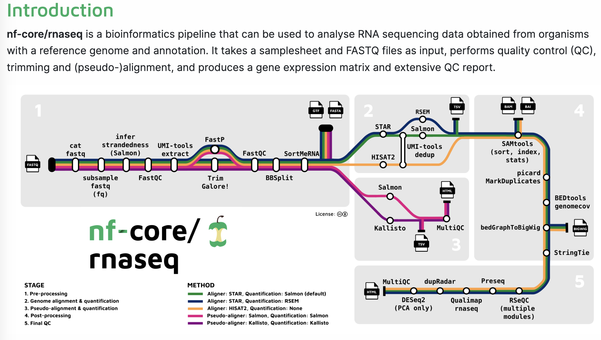

# Running an nf-core pipeline (RNA-Seq)

In this final practical, we will show you how to run a nf-core pipeline (https://nf-co.re/rnaseq/3.14.0). nf-core set the standard for building gold standard, reproducible data pipelines, and have become the industry standard for processing RNA-Seq and other common "omics" data types.

They are made up of the efforts of the entire community, and are coordinated by a dedicated team at nf-core. For those beginning their bioinformatics journey, they are a super useful way to get the heavy lifting of bioinformatics done in an efficient way.

## Practical course

Follow the next steps to run the nf-core RNA-Seq pipeline on some example data. The aim of this section is to help you feel more confident running nf-core pipelines.

**Step 0. Understanding RNA-Seq**

Before running an RNA-Seq analysis, it is important to understand what we are doing and why. This will be covered in the lecture.

For more reading, It is worth following other online tutorials such as the following to learn more about how to process RNA-Seq data:

Links to great RNA-Seq educational resources

 
https://www.azenta.com/blog/quick-start-guide-rna-seq-data-analysis#step1
 
https://bioinformatics-core-shared-training.github.io/RNAseq-R/
 
https://learn.gencore.bio.nyu.edu/rna-seq-analysis/
 

 
 
For our run today, we will run an experiment from the following paper:
https://pubmed.ncbi.nlm.nih.gov/30576656/

Where we want to compare in yeast cells the effect of depletion of the trancription factor (Rap1)

 

**Step 1. Check out the raw RNA-Seq data provided for this course**

For this exercise, we have pre-downloaded a subset of RNA-Seq data from Wu et al. 2018, representing RNA from wild type and Rap1 depletion yeast cells.

This is in the folder `data`. It is important when you receive data to check it yourself manually to see exactly what it is.

Try to `head` one of the fastq files in the `data` folder (don't panic if you get `<��xT�r-�B7�+7P�~~�����...`, this is expected).

The fastq files in this directory are compressed using the command `gzip`, so they are not human readable files.

We haven't covered this in the basic training, but here is a command you could use to head the top of a gzipped file:

`zcat data/SRR6357070_1.fastq.gz | head`

So `cat` has a related command that can read gzipped files (there is no `zhead`), but we can pipe the out to head to get what we want.

Can you now count the number of lines in a gzipped file using the same logic as above:

Answer

 

`zcat data/SRR6357070_1.fastq.gz | wc -l`

or

`zcat data/SRR6357070_1.fastq.gz | wc`

 

**Step 2. Check out the nf-core rnaseq repo**

 

First go to nf-core rnaseq [here](https://nf-co.re/rnaseq/3.14.0) , and try to understand what the pipeline is doing and what inputs the pipeline expects.

Cheat sheet

 
Hopefully you found that you require:
  
* a genome (in fasta) 

* an annotation (in gtf or gff3)

* an input samplesheet that contains links to the raw RNA-Seq fastq data

 

**Step 3. Build a samplesheet**

 
Now we need to find the data and start building the samplesheet.csv file. The raw data are in `./data`.

SRR6357070 is wild type (paired end reads)
SRR6357071 is wild type (paired end reads)
SRR6357072 is wild type (paired end reads)

SRR6357073 is manipulated (single end reads)
SRR6357074 is manipulated (single end reads)
SRR6357075 is manipulated (single end reads)

 Can you build yourself a sample sheet with the data provided using their full paths, with both wild-type and manipulated replicates.

You can see the example sample sheet [here](https://nf-co.re/rnaseq/3.14.0/docs/usage#samplesheet-input). 

Choose whichever name for the sample as you wish, and choose auto for the strandedness field.
 
 

Cheat sheet

 
sample,fastq_1,fastq_2,strandedness 
CONTROL_REP1,/workspace/gitpod/eco-flow-training/data/SRR6357070_1.fastq.gz,/workspace/gitpod/eco-flow-training/data/SRR6357070_2.fastq.gz,auto 
CONTROL_REP2,/workspace/gitpod/eco-flow-training/data/SRR6357071_1.fastq.gz,/workspace/gitpod/eco-flow-training/data/SRR6357071_2.fastq.gz,auto 
CONTROL_REP3,/workspace/gitpod/eco-flow-training/data/SRR6357072_1.fastq.gz,/workspace/gitpod/eco-flow-training/data/SRR6357072_2.fastq.gz,auto 
MANIPULATED_REP1,/workspace/gitpod/eco-flow-training/data/SRR6357073_1.fastq.gz,,auto 
MANIPULATED_REP2,/workspace/gitpod/eco-flow-training/data/SRR6357074_1.fastq.gz,,auto 
MANIPULATED_REP3,/workspace/gitpod/eco-flow-training/data/SRR6357075_1.fastq.gz,,auto 
 
 
A sample sheet will contain a sample name, followed by the forward reads (normally R1), followed by the reverse reads (normally R2, if you have them), followed by the strand information (if you want the pipeline to calculate this for you, you use auto, else you write un-stranded, forward or reverse).

 

You can also see this example template on the nf-core rnaseq website [here](https://raw.githubusercontent.com/nf-core/test-datasets/7f1614baeb0ddf66e60be78c3d9fa55440465ac8/samplesheet/v3.10/samplesheet_test.csv)

**Step 4. Download the genome and annotation**
 
 
Download the genome and gff file to the data folder.

The genome and annotation are on a webpage, so we can use `wget` to download the genome and annotation, as follows:

`wget -o genome.fasta https://raw.githubusercontent.com/nf-core/test-datasets/7f1614baeb0ddf66e60be78c3d9fa55440465ac8/reference/genome.fasta`
 

`wget -o genes.gff.gz https://raw.githubusercontent.com/nf-core/test-datasets/7f1614baeb0ddf66e60be78c3d9fa55440465ac8/reference/genes.gff.gz`

**Step 5. Running the pipeline**
 
 
Run the nf-core RNA-Seq pipeline on your input files. Read the online instructions of what you need to do to run the pipeline (found here: https://nf-co.re/rnaseq/3.14.0/docs/usage). Using your own paths to genome (`--fasta`), annotation (`--gtf`) and samplesheet (`--input`). You also need to set an `--output` name (to anything you wish), else you will receive an error.
 
 
You should use the `--fasta /path/to/genome.fasta`,  `--gtf /path/to/genes.gff.gz`, `--input /path/to/samplesheet.csv` and `--output name` flags.

**PLUS**: you need to use the flag `--profile docker` . This is to ensure you are running from docker containers to pull all the programs you need to run nf-core rnaseq. Otherwise you woud have to install all the software manually. In addition, there are other profiles for other container engines (e.g. `--singularity` or `--apptainer`, used when on an HPC, contact your HPC team for help).
 
 

Cheat sheet

 
You command should look like:

`nextflow run nf-core/rnaseq` -profile docker 
--input /workspace/training/eco-flow-training/mysamplesheet \` `--gtf /workspace/training/eco-flow-training/annotation.gtf \` `--fasta /workspace/training/eco-flow-training/genome.fasta\` `--output my_results` 

 

**Step 6. Checking out the documentation**
 
 
You pipeline should now be working.
 

If it ends in an error, most likely you did not specify the correct paths to the three input files OR maybe you forgot to use the `--profile docker` flag. Raise a comment to the tutor if you are stuck at this stage. 
 

If your pipeline did succeed, you can wait for the pipeline to finish running and start exploring the output of the pipeline.

An overview of all the output types is found here: https://nf-co.re/rnaseq/3.14.0/docs/output. 

Spend 10 minutes exploring the output documentation, and by this time your pipeline run should have finished so you can then explore your own results. 

 

**Step 7. Check the FASTQC results**

Find (in the output directory you chose) and check that the reads were of sufficient quality.
 
To know what the fastq quality scores should look like, follow this guide:

https://bioinfo.cd-genomics.com/quality-control-how-do-you-read-your-fastqc-results.html

## Finish

You have finished the course. We hope you have learnt some of the basics of pipeline usage with Nextflow. 

The next steps are learning to write in Nextflow yourself. There are awesome training materials at https://training.nextflow.io/

Further, Eco-Flow will be providing more foundational Nextflow courses soon, so feel free to email us, and we can add you to our mailing list (ecoflow . ucl @ gmail . com)