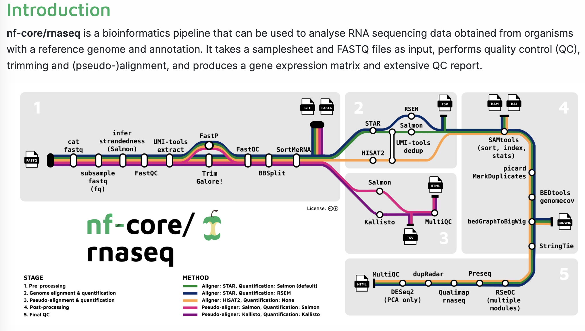

# Running an nf-core pipeline (RNA-Seq)

🧭 [◀️ Part 2 · Pipelines](./pipelines.md) &nbsp;|&nbsp; [🏠 Course menu](../README.md) &nbsp;|&nbsp; **Next:** [Part 4 · Differential expression ▶️](./differential.md)

---

⏱ **Estimated time:** ~60–90 minutes (including pipeline run time) &nbsp;•&nbsp; 🟡 Practical

In this practical you'll run a real, published-standard **nf-core RNA-Seq pipeline** ([nf-core/rnaseq](https://nf-co.re/rnaseq/3.14.0)) on example data — from raw sequencing reads all the way to a gene-count table and a quality report.

**nf-core** is a community that builds gold-standard, reproducible data pipelines that have become the industry standard.


**nf-core** have a variety of [pipelines](https://nf-co.re/pipelines) that tackle key bioinformatic challenges. Join them on Slack [here](https://nf-co.re/join/slack).

### What you'll do

- Inspect the raw RNA-Seq data
- Work out what inputs the pipeline needs
- Build a **samplesheet** describing your samples
- Download a reference **genome** and **annotation**
- **Run** the pipeline with Docker containers
- Explore the **results** (quality reports and gene counts)
- Learn to **`-resume`** a run and change pipeline options

> ✅ **Before you start**, make sure you've completed [Setup](./setup.md) and that your terminal is inside the **`eco-flow-training`** folder. Check with:
> ```bash
> pwd     # should end in eco-flow-training
> ```
> Everything below assumes you run commands from there. In Codespaces the full path is `/workspaces/training/eco-flow-training`; on a local machine substitute your own path (use `pwd` to see it).

### The experiment

We'll compare gene expression between **wild-type** yeast cells and cells with a **Rap1 gene knock-down (KD)**. There are 3 replicates of each condition. The data come from this paper: https://pubmed.ncbi.nlm.nih.gov/30576656/


| Sample | Condition | Reads |
| --- | --- | --- |
| SRR6357070 | wild-type | paired-end (`_1` + `_2`) |
| SRR6357071 | wild-type | paired-end (`_1` + `_2`) |
| SRR6357072 | wild-type | paired-end (`_1` + `_2`) |
| SRR6357073 | manipulated (KD) | single-end (`_1` only) |
| SRR6357074 | manipulated (KD) | single-end (`_1` only) |
| SRR6357075 | manipulated (KD) | single-end (`_1` only) |

---

## Step 0 — Understand RNA-Seq

Before running an RNA-Seq analysis, it helps to understand what it *is*. In short: RNA-Seq measures how much each gene is being **expressed** by sequencing the RNA in a sample, mapping those reads back to a reference genome, and counting how many land on each gene. This is covered in the lecture; the resources below go deeper.

<details>
<summary>📚 Great RNA-Seq learning resources</summary>

- [Azenta — Quick-start guide to RNA-Seq data analysis](https://www.azenta.com/blog/quick-start-guide-rna-seq-data-analysis#step1)
- [Bioinformatics Core (Cambridge) — RNAseq in R](https://bioinformatics-core-shared-training.github.io/RNAseq-R/)
- [NYU GenCore — RNA-Seq analysis](https://learn.gencore.bio.nyu.edu/rna-seq-analysis/)
</details>

---

## Step 1 — Inspect the raw data

It's always worth looking at your data by eye before running anything. The reads live in the `data` folder.

The FASTQ files are compressed with `gzip` (they end in `.gz`), so they aren't directly human-readable — plain `cat`/`head` would print gibberish (don't panic if you see `<��xT�r-�B7�...`, that's expected!). Instead, use **`zcat`** (from Part 1), which reads gzipped files, and pipe it to `head`:

> ▶️ **Try it — peek at a compressed FASTQ file**
>
> ```bash
> zcat data/SRR6357070_1.fastq.gz | head
> ```
>
> <details>
> <summary>✅ Expected output</summary>
>
> Groups of four lines per read — an ID, the sequence, a `+`, and quality scores:
>
> ```
> @SRR6357070.1 1/1
> GATCGGAAGAGCACACGTCTGAACTCCAGTCAC...
> +
> AAAAAEEEEEEEEEEEEEEEEEEEEEEEEEEEE...
> ```
> </details>

There's no `zhead`, so we pipe `zcat` into `head`. The same trick lets you **count** the reads:

> ▶️ **Try it — count the lines (and work out the reads)**
>
> ```bash
> zcat data/SRR6357070_1.fastq.gz | wc -l
> ```
>
> <details>
> <summary>✅ Expected output</summary>
>
> ```
> 200000
> ```
>
> FASTQ uses **4 lines per read**, so that's `200000 / 4 = 50000` reads in this file.
> </details>

---

## Step 2 — Explore the pipeline's requirements

Go to the nf-core/rnaseq page and read what the pipeline does and what inputs it expects: 👉 **https://nf-co.re/rnaseq/3.14.0**



<details>
<summary>Cheat sheet — what the pipeline needs</summary>

To run nf-core/rnaseq you need three things:

* a **genome** (in FASTA format)
* an **annotation** (in GTF or GFF format) — tells the pipeline where the genes are
* an **input samplesheet** (CSV) that links to your raw RNA-Seq FASTQ data
</details>

> 💡 **What the pipeline will do for you** (automatically, in containers): quality-check the reads (FastQC), trim adapters (Trim Galore), align to the genome (STAR), quantify gene expression (Salmon), and summarise everything into one report (MultiQC). That's a lot of tools you *don't* have to install yourself!

---

## Step 3 — Build the samplesheet

The **samplesheet** is a CSV file that tells the pipeline which files belong to which sample. Create a file called `samplesheet.csv` in the `eco-flow-training` folder (e.g. with `nano samplesheet.csv`).

It has four columns:

| Column | Meaning |
| --- | --- |
| `sample` | A name you choose for the sample (must match across replicates you want grouped) |
| `fastq_1` | Full path to the forward reads (R1) |
| `fastq_2` | Full path to the reverse reads (R2) — **leave empty for single-end** samples |
| `strandedness` | Library strandedness — use `auto` to let the pipeline detect it |

> ⚠️ **Paired vs single-end:** samples SRR6357070–072 are paired-end (fill both `fastq_1` and `fastq_2`); SRR6357073–075 are single-end (fill `fastq_1`, leave `fastq_2` blank — note the trailing comma).

Try to build the samplesheet yourself using the [example on the nf-core page](https://nf-co.re/rnaseq/3.14.0/docs/usage#samplesheet-input), then compare with the cheat sheet.

<details>
<summary>Cheat sheet — full samplesheet.csv</summary>

```csv
sample,fastq_1,fastq_2,strandedness
CONTROL_REP1,/workspaces/training/eco-flow-training/data/SRR6357070_1.fastq.gz,/workspaces/training/eco-flow-training/data/SRR6357070_2.fastq.gz,auto
CONTROL_REP2,/workspaces/training/eco-flow-training/data/SRR6357071_1.fastq.gz,/workspaces/training/eco-flow-training/data/SRR6357071_2.fastq.gz,auto
CONTROL_REP3,/workspaces/training/eco-flow-training/data/SRR6357072_1.fastq.gz,/workspaces/training/eco-flow-training/data/SRR6357072_2.fastq.gz,auto
MANIPULATED_REP1,/workspaces/training/eco-flow-training/data/SRR6357073_1.fastq.gz,,auto
MANIPULATED_REP2,/workspaces/training/eco-flow-training/data/SRR6357074_1.fastq.gz,,auto
MANIPULATED_REP3,/workspaces/training/eco-flow-training/data/SRR6357075_1.fastq.gz,,auto
```

The `CONTROL_*` samples are the wild-type (paired-end) and `MANIPULATED_*` are the Rap1 knock-downs (single-end). **Keep these sample names** — Part 4 (differential expression) reuses them.
</details>

> 💡 **Paths must be absolute.** The paths above are the Codespaces location. On a local machine, replace `/workspaces/training/eco-flow-training` with the output of your own `pwd`.

---

## Step 4 — Download the genome and annotation

The pipeline needs a reference **genome** (FASTA) and **annotation** (GFF). Download both into the `eco-flow-training` folder (the same place as your samplesheet) using `wget` (from Part 1):

```bash
wget -O genome.fasta https://raw.githubusercontent.com/nf-core/test-datasets/7f1614baeb0ddf66e60be78c3d9fa55440465ac8/reference/genome.fasta
wget -O genes.gff.gz https://raw.githubusercontent.com/nf-core/test-datasets/7f1614baeb0ddf66e60be78c3d9fa55440465ac8/reference/genes.gff.gz
```

> ▶️ **Check the downloads**
>
> ```bash
> ls -lh genome.fasta genes.gff.gz
> ```
>
> <details>
> <summary>✅ Expected output</summary>
>
> Both files should be listed with a non-zero size:
>
> ```
> -rw-r--r-- 1 user user  ...  genome.fasta
> -rw-r--r-- 1 user user  ...  genes.gff.gz
> ```
>
> If a file is 0 bytes or missing, the download failed — check your internet connection and re-run the `wget`.
> </details>

> 💡 The `-O` flag names the downloaded file. The genome is the yeast reference sequence; the GFF lists where each gene sits on that sequence.

---

## Step 5 — Run the pipeline

Now run nf-core/rnaseq, pointing it at your genome (`--fasta`), annotation (`--gff`), samplesheet (`--input`) and an output directory name (`--outdir`, choose anything).

Read the official run instructions here: https://nf-co.re/rnaseq/3.14.0/docs/usage

Two extra flags you **must** include in this environment:

- **`-profile docker`** — runs every step inside its Docker container, so you don't have to install any of the underlying tools. (On an HPC you'd use `-profile singularity` or `apptainer` instead — ask your HPC team.)
- **`-c .../codespaces.config`** — Codespaces has limited memory, so this config caps it appropriately. Without it the run may fail on larger steps.

We also pin the pipeline version with **`-r 3.14.0`** so you get exactly the version this course was written for.

<details>
<summary>Cheat sheet — the full command</summary>

```bash
nextflow run nf-core/rnaseq \
-r 3.14.0 \
-profile docker \
-c /workspaces/training/eco-flow-training/codespaces.config \
--input /workspaces/training/eco-flow-training/samplesheet.csv \
--gff /workspaces/training/eco-flow-training/genes.gff.gz \
--fasta /workspaces/training/eco-flow-training/genome.fasta \
--outdir my_results
```

The `\` at the end of each line just lets one command span several lines for readability.
</details>

> 👉 **Single vs double dashes matter!** A single dash (`-profile`, `-r`, `-c`, `-resume`) is a **Nextflow** core option. A double dash (`--input`, `--fasta`, `--outdir`) is a **pipeline** parameter defined inside nf-core/rnaseq.

> ✅ **What success looks like:** Nextflow prints a banner and then a live list of processes as they run — something like:
>
> ```
>  N E X T F L O W   ~  version 24.x.x
>  Launching `https://github.com/nf-core/rnaseq` [gigantic_newton] ...
>  executor >  local
>  [a1/b2c3d4] NFCORE_RNASEQ:...:FASTQC (CONTROL_REP1)   [100%] 6 of 6 ✔
>  [e5/f6a7b8] NFCORE_RNASEQ:...:STAR_ALIGN (...)         [ 50%] 3 of 6
>  ...
> ```
>
> This run takes roughly **10–20 minutes** on the small test data — leave it running. The first time, Nextflow also downloads the containers, which adds a few minutes.

### Troubleshooting Step 5

If the run stops with an error, it's almost always one of these:

<details>
<summary>❌ <code>Missing required parameter: --input</code> / <code>--outdir</code></summary>

You didn't supply one of the required parameters. Check every `--input`, `--fasta`, `--gff` and `--outdir` is present and spelled correctly.
</details>

<details>
<summary>❌ <code>Not a valid path value: 'genes.gff.gz'</code></summary>

A path is wrong or not absolute. Provide the **full** path, e.g. `/workspaces/training/eco-flow-training/genes.gff.gz`, and confirm the file exists with `ls -l`.
</details>

<details>
<summary>❌ <code>.command.sh: line 7: fastqc: command not found</code> (exit status 127)</summary>

You forgot **`-profile docker`**. Without it, Nextflow looks for the tools installed locally — but they aren't. Adding `-profile docker` makes each step run inside a container that already has the tool.
</details>

If you get a different error, grab a tutor.

---

## Step 6 — Explore the results

Once the pipeline finishes (`Pipeline completed successfully`), look inside your `--outdir` folder (`my_results`).

> ▶️ **See what was produced**
>
> ```bash
> ls my_results
> ```
>
> <details>
> <summary>✅ Roughly what you'll see</summary>
>
> ```
> fastqc  multiqc  pipeline_info  star_salmon  trimgalore  ...
> ```
>
> Each folder holds the output of one stage of the pipeline.
> </details>

The full catalogue of outputs is documented here: https://nf-co.re/rnaseq/3.14.0/docs/output — spend ~10 minutes skimming it while the run finishes.

**The two things to look at first:**

1. **The MultiQC report** — `my_results/multiqc/star_salmon/multiqc_report.html`. This single HTML page summarises quality and alignment across *all* samples. To view it in Codespaces, right-click the file in the Explorer and choose **"Open with Live Server"** (the extension is pre-installed), or download it (right-click → Download) and open it in your browser.

2. **The FastQC results** — under `my_results/fastqc/`. Check whether the raw reads were good quality. This guide explains how to read the FastQC plots and quality scores: https://bioinfo.cd-genomics.com/quality-control-how-do-you-read-your-fastqc-results.html

> 🧬 **The key file for Part 4:** the gene-count table lives at
> `my_results/star_salmon/salmon.merged.gene_counts.tsv`.
> You'll load this into R in the next section to find differentially expressed genes.

We'll discuss the reports together in class.

---

## Step 7 — Resuming a run and changing options

Real analyses are rarely run just once — you tweak options and re-run. Two things make that painless.

### Changing an option

The pipeline has many options. For example, you can switch the alignment/quantification tools to STAR + RSEM with `--aligner star_rsem` (see the [alignment options docs](https://nf-co.re/rnaseq/3.14.0/docs/usage#alignment-options)). Work out how you'd modify your command — **but don't run it yet:**

<details>
<summary>Answer — the modified command</summary>

```bash
nextflow run nf-core/rnaseq \
-r 3.14.0 \
-profile docker \
-c /workspaces/training/eco-flow-training/codespaces.config \
--input /workspaces/training/eco-flow-training/samplesheet.csv \
--gff /workspaces/training/eco-flow-training/genes.gff.gz \
--fasta /workspaces/training/eco-flow-training/genome.fasta \
--outdir my_results \
--aligner star_rsem
```

(Note the `\` after `--outdir my_results` — every line except the last needs one, or the `--aligner` option would be dropped.)
</details>

### The `-resume` flag

Add **`-resume`** and Nextflow will reuse the **cached** results of any steps that haven't changed, instead of recomputing them from scratch. If you re-run the command above with `-resume`, only the steps affected by the new `--aligner` option need to re-run — everything before that is pulled from the cache.

> ✅ **What you'll see with `-resume`:** unchanged processes are marked as cached, e.g.
>
> ```
> [a1/b2c3d4] NFCORE_RNASEQ:...:FASTQC (CONTROL_REP1)  [100%] 6 of 6, cached: 6 ✔
> ```
>
> The word **`cached`** tells you Nextflow skipped the real work and reused the previous result — a huge time-saver during development.

---

## Finish

🎉 **You've finished the course!** You've run a complete, reproducible RNA-Seq pipeline — from raw reads to gene counts and quality reports — using industry-standard nf-core tooling.

**Next steps:**

- Continue to **[Part 4 · Differential expression ▶️](./differential.md)** to analyse the gene counts you just produced.
- Learn to **write** your own Nextflow: the excellent [Seqera training](https://training.nextflow.io/).
- Eco-Flow will be providing more foundational Nextflow courses soon — email us to join the mailing list: **ecoflow . ucl @ gmail . com**

---

🧭 [◀️ Part 2 · Pipelines](./pipelines.md) &nbsp;|&nbsp; [🏠 Course menu](../README.md) &nbsp;|&nbsp; **Next:** [Part 4 · Differential expression ▶️](./differential.md)
