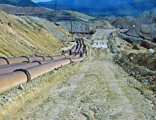

# Pipeline information

This section is presented as a lecture. 

A video link will be added after the course.

Below we have a brief summary:

## Nextflow

Nextflow is a language, runtime and community.

**Language**: It is a way to structure pipelines [nextflow.io](https://www.nextflow.io/docs/latest/index.html) 
**Runtime**: Has simple ways to run the pipelines across different infrastructure (on HPC, locally, AWS, etc.) 
**Community**: It is a huge and diverse community all commited to build reproducible, effective and automated data pipelines ([nf-core.io](https://nf-co.re/)) 

To learn more about Nextflow there is excellent training material at https://training.nextflow.io/

In this course, we will cover a short lecture on Nextflow, the video/slides of which will be uploaded after the course.

## Next

When you are ready:

Head to part 3 -> [click here](./nfcore_rnaseq.md)

or

Head back to menu   -> [click here](../README.md)
 

