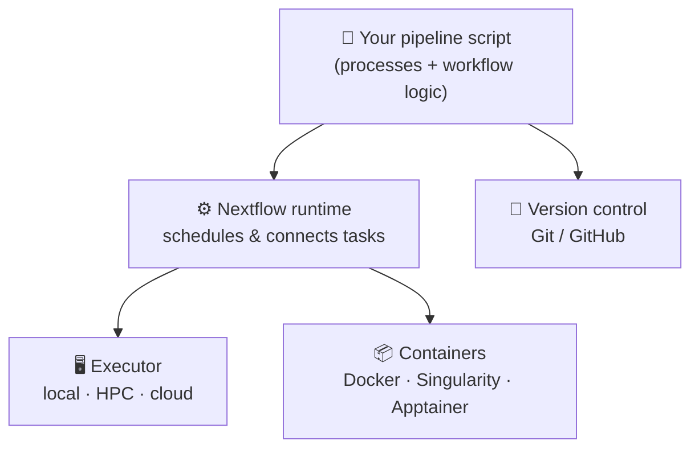
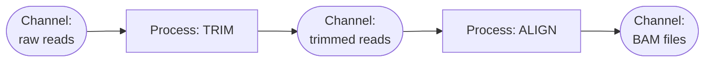
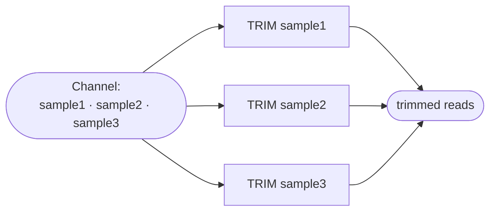

# Pipeline information

🧭 [◀️ Part 1 · Command line](./commandline.md) &nbsp;|&nbsp; [🏠 Course menu](../README.md) &nbsp;|&nbsp; **Next:** [Part 3 · nf-core RNA-Seq ▶️](./nfcore_rnaseq.md)

---


⏱ **Estimated reading time:** ~15 minutes &nbsp;•&nbsp; 📖 Lecture companion (no coding)

> 🎥 **This section is normally delivered as a live lecture** (a video link will be added after the course). The written version below covers the same material, so you can follow along, revisit it, or catch up if you missed the talk.

### What this section covers

- **Part A — Why we need pipelines:** reproducibility, complexity, and the pain of scaling analyses
- **Part B — Nextflow:** what it is and how it ties everything together
- **Part C — How Nextflow works:** processes, channels, workflows and parallelism
- **Part D — Containers:** why they matter for reproducibility
- **Part E — nf-core:** the community and its ready-made pipelines
- **Further material:** where to go next

---

## Part A — Why do we need pipelines?

### 1. The reproducibility crisis

Science relies on results being **reproducible** — someone else should be able to take your data and methods and arrive at the same answer. Yet across many fields, a large fraction of published results cannot be reproduced. In computational biology a big part of the problem is the *analysis* itself: the exact software, versions, parameters and environment used are often not recorded well enough for anyone (including the original author, months later!) to repeat them.

> 💡 **The goal of a pipeline** is to capture *every* step of an analysis — the tools, their versions, the parameters and the order they run in — so the whole thing can be re-run and produce the same result on demand.

### 2. Modern bioinformatics is complex

A realistic analysis is rarely one command. An RNA-Seq experiment (like the one you'll run in Part 3) might involve:

- quality control of raw reads (e.g. FastQC)
- trimming adapters and low-quality bases (e.g. Trim Galore)
- aligning reads to a genome (e.g. STAR)
- quantifying gene expression (e.g. Salmon/RSEM)
- summarising and reporting (e.g. MultiQC)

Each of those is a separate program, with its own inputs, outputs, options and software dependencies — often chained across **dozens of steps** and **many samples**. Running each step by hand is slow, error-prone and almost impossible to reproduce exactly.

### 3. The same analysis can give different results on different computers

This is the subtle one. Even with identical input data and identical commands, **you can get different numerical results on different machines** — because of differences in operating system, system libraries, or tool versions.

> 📄 **Di Tommaso et al. (2017)** demonstrated exactly this problem and showed that packaging tools in **containers** makes results consistent across systems.
> *Di Tommaso, P., Chatzou, M., Floden, E.W. et al. "Nextflow enables reproducible computational workflows." Nature Biotechnology 35, 316–319 (2017).* https://doi.org/10.1038/nbt.3820

If "which laptop you ran it on" can change your answer, you can't trust the answer — and neither can a reviewer.

### 4. Configuring for HPC and the cloud is hard

Real datasets are big, so analyses usually need to run on a **High-Performance Computing (HPC) cluster** or in the **cloud** (AWS, Google Cloud, Azure) rather than a laptop. But every HPC scheduler (SLURM, SGE, PBS…) and every cloud platform has its own way of submitting jobs, requesting memory/CPUs, and moving data. Rewriting your analysis for each environment is tedious and fragile.

### 5. Nextflow provides a solution

A **workflow manager** solves all four problems at once. It lets you describe your analysis *once*, then:

| Problem | How a pipeline manager helps |
| --- | --- |
| Reproducibility crisis | Captures every step, version and parameter in code |
| Complexity | Automates chaining of many tools across many samples |
| Different results on different machines | Runs each tool inside a pinned **container** |
| HPC / cloud is hard | Separates *what* to run from *where* to run it |

**Nextflow** is one of the most widely used workflow managers in bioinformatics — and it's the one this course is built around.

---

## Part B — What is Nextflow?


**Nextflow** is a language (and runtime) for scaffolding a series of tasks into a modern, reproducible workflow. It provides:

- **automatic software management** using containers (no manual installs),
- a **dataflow programming model** that passes data cleanly between steps, and
- a **modular** design, so a step written once can be reused in any pipeline.

Nextflow has several features that make it especially powerful:

- **Portability** — the same pipeline runs locally, on HPC, or in the cloud, just by changing configuration.
- **Version control** — pipelines are Git repositories, so runs are transparent and traceable.
- **Testing** — modules can be unit-tested (e.g. with nf-test) to catch failures early.
- **Community** — a large, active ecosystem building reproducible pipelines together (see [nf-core](https://nf-co.re/)).

### 7. How Nextflow ties it all together

The key idea is that Nextflow **separates the description of your analysis from the details of running it**. Your pipeline script says *what* should happen; Nextflow connects that to *where* it runs, *which software* it uses, and *how* it's tracked:


```mermaid
flowchart TB
  A["📜 Your pipeline script<br/>(processes + workflow logic)"] --> B["⚙️ Nextflow runtime<br/>schedules &amp; connects tasks"]
  B --> C["🖥️ Executor<br/>local · HPC · cloud"]
  B --> D["📦 Containers<br/>Docker · Singularity · Apptainer"]
  A --> E["🔀 Version control<br/>Git / GitHub"]
```

Because these concerns are separated, you can move the same pipeline from your laptop to a supercomputer by changing a config file — the science stays identical.

---

## Part C — How Nextflow works

### 8. Processes and channels

Nextflow is built from two core concepts:

- **Processes** — a single job: a script or program (with its own inputs, outputs and command). Think of a process as one **step** or module of the pipeline.
- **Channels** — the "conveyor belts" that carry data *into* processes and *between* them. Processes read from and write to channels, so Nextflow always knows how data flows.


```mermaid
flowchart LR
  ch1(["Channel:<br/>raw reads"]) --> P1["Process: TRIM"]
  P1 --> ch2(["Channel:<br/>trimmed reads"]) --> P2["Process: ALIGN"]
  P2 --> ch3(["Channel:<br/>BAM files"])
```

### The structure of a process

A typical process looks like this:

```groovy
process TRIM {

    input:
    path 'sample.1.fastq'

    output:
    path 'sample.1.trim.fastq'

    script:
    """
    trim_galore -o sample.1.trim.fastq sample.1.fastq
    """

}
```

In the process above:

- the **input** is a specific FASTQ file,
- the **output** is the trimmed FASTQ file it produces, and
- the **script** block (between the `"""` triple quotes) is the actual command that runs.

### The structure of a workflow

Processes are wired together in a **workflow** block. The workflow decides which processes run and how the output channel of one becomes the input channel of the next:

```groovy
workflow {
    reads_ch = Channel.fromPath('data/*.fastq')
    TRIM(reads_ch)
    ALIGN(TRIM.out)
}
```

You never tell Nextflow the exact *order* to run things step by step. Instead you describe how data flows, and Nextflow works out the order automatically from those connections.

### 9. How Nextflow parallelises the dataflow

Because data travels in channels, Nextflow can see when tasks are **independent** — and run them **at the same time**. If you feed three samples into a channel, the `TRIM` process runs three times in parallel (as many at once as your machine or cluster allows):


```mermaid
flowchart LR
  ch(["Channel:<br/>sample1 · sample2 · sample3"]) --> P1["TRIM sample1"]
  ch --> P2["TRIM sample2"]
  ch --> P3["TRIM sample3"]
  P1 --> out(["trimmed reads"])
  P2 --> out
  P3 --> out
```

This is the big win of the dataflow model: you write the logic *once* for a single sample, and Nextflow scales it out across all your samples and all your available compute — no extra code required.

---

## Part D — Why use containers?

### 10. Containers make software reproducible

A **container** bundles a program *together with everything it needs to run* — its exact version, its libraries, and its operating-system dependencies — into a single portable package (e.g. **Docker**, **Singularity**, or **Apptainer**).

This is what solves problem **#3** from Part A: instead of relying on whatever version of a tool happens to be installed on a given machine, Nextflow pulls the *same* container every time, so:

- you don't have to install any of the underlying tools yourself,
- everyone runs byte-for-byte the same software, and
- results are consistent across your laptop, an HPC cluster and the cloud.

> 🧪 In Part 3 you'll use `-profile docker`, which tells Nextflow to run every step inside its container. That single flag is why you don't need to install FastQC, STAR, Salmon and the rest by hand.

---

## Part E — The nf-core community

### 11. What is nf-core?

[**nf-core**](https://nf-co.re/) is a community effort to build **gold-standard, reproducible** Nextflow pipelines. Rather than everyone writing their own RNA-Seq or variant-calling pipeline from scratch, nf-core provides curated, peer-reviewed, well-tested and thoroughly documented pipelines that have become an industry standard.

Highlights of the nf-core ecosystem:

- **A catalogue of ready-to-run [pipelines](https://nf-co.re/pipelines)** covering many common analyses — RNA-Seq, variant calling, single-cell, metagenomics, and many more.
- **Consistency** — every pipeline follows the same conventions, so once you can run one, you can run them all.
- **Built-in best practice** — containers, testing, versioning and documentation come as standard.
- **A welcoming community** — join them on [Slack](https://nf-co.re/join/slack).

In Part 3 you'll run the real [**nf-core/rnaseq**](https://nf-co.re/rnaseq) pipeline on example data — putting everything in this lecture into practice.

---

## Further material

If you'd like to go deeper (highly recommended if you want to write your own pipelines):

| Resource | Link |
| --- | --- |
| **Nextflow documentation** | https://www.nextflow.io/docs/latest/ |
| **Seqera's Nextflow training course** | https://training.nextflow.io/ |
| **Nextflow Slack** | https://www.nextflow.io/blog/2022/nextflow-is-moving-to-slack.html |
| **Nextflow on GitHub** | https://github.com/nextflow-io/nextflow |
| **nf-core community & pipelines** | https://nf-co.re/ |

---

## Next

When you are ready:

Head to part 3 -> [click here](./nfcore_rnaseq.md)

or

Head back to menu   -> [click here](../README.md)
<br/>

---

🧭 [◀️ Part 1 · Command line](./commandline.md) &nbsp;|&nbsp; [🏠 Course menu](../README.md) &nbsp;|&nbsp; **Next:** [Part 3 · nf-core RNA-Seq ▶️](./nfcore_rnaseq.md)
