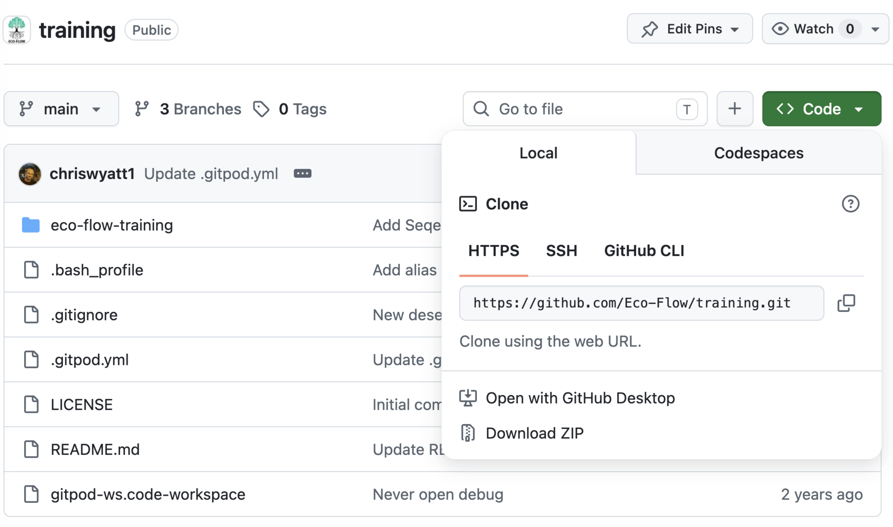
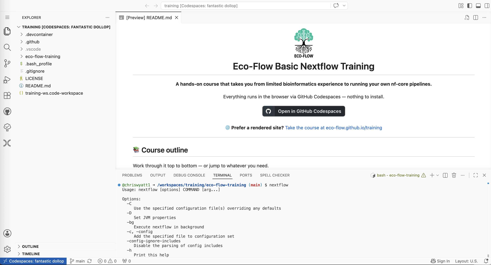

# Setup

## Prerequisites

For this course you require three things:

1. A stable internet connection.

2. A browser (ideally chrome based, e.g. Google Chrome, Microsoft edge, Brave, etc.).

3. A Github account (https://github.com/join).
Please follow the instructions, it should take less than 15 minutes.
<br/>You may need to add a secure entry with your mobile phone.

   


## Setup of training environment

> ✅ **Recommended:** use **GitHub Codespaces** (Option A below). It comes with everything pre-installed — Nextflow, Java, Docker and all the course files — so there is nothing to configure and everyone works in an identical environment. If in doubt, use Codespaces.

## Option A — GitHub Codespaces (recommended)

Next, you will need to test whether you can log-in to the Codespaces VS code training environment. 
This is a free coding environment (though with limited per month usage), for testing and developing code, but also for training. 

It has all the code installed and files you need to complete the course.

Follow the following link:

(https://github.com/Eco-Flow/training/tree/main) 

and click on the code button, and then codespaces, then "Create codespaces on main".




Choose Login with Github and enter your credentials.

If you see the following screen you know you are into Codespaces. You are now ready to move to [Step 1 command line basics](../docs/commandline.md).


If you have failed to get to this point, please shout out to the tutor!

If you are on our VSCode Codespaces training environment, spend 10 minutes getting to know the environment.
Go to the VSCode website to learn about what you can do in VSCode: https://code.visualstudio.com/docs/getstarted/userinterface

Remember to close the browser window when you are done, but remember that this will end your session, so make sure to save anything you wish before you close the browser.


## Option B — Run locally (not recommended)

> ⚠️ **This is not the preferred way to take the course.** Codespaces (Option A) gives everyone an identical, pre-configured environment. Running locally means installing and troubleshooting the tools yourself, and results can vary between machines — this is especially fiddly on Windows. Only choose this route if you cannot use Codespaces, and be ready to debug your own setup.

If you still want to run locally, you will need the following installed on your machine:

1. **[VS Code](https://code.visualstudio.com/)** — the editor used throughout the course.
2. **[Git](https://git-scm.com/downloads)** — to clone the course repository.
3. **Java 17+** — required by Nextflow (check with `java -version`).
4. **[Nextflow](https://www.nextflow.io/docs/latest/install.html)** — the workflow engine (you'll also (re)install it as an exercise in Part 1).
5. **[Docker](https://docs.docker.com/get-docker/)** — used to run the nf-core RNA-Seq pipeline containers. Make sure Docker Desktop is running.

> 💡 **Windows users:** install and run everything inside the **Windows Subsystem for Linux (WSL)** rather than native Windows, so the UNIX commands in Part 1 behave as described.

Then clone the course repository and open it in VS Code:

```bash
git clone https://github.com/Eco-Flow/training.git
cd training/eco-flow-training
code .
```

Unlike Codespaces, your terminal will **not** start inside `eco-flow-training` automatically, and the absolute paths shown in the exercises (e.g. `/workspaces/training/eco-flow-training`) will be different on your machine. That's fine — just make sure you `cd` into the `eco-flow-training` folder before starting the exercises. What matters is that `pwd` **ends in `eco-flow-training`**.

Once you can open the repo in VS Code and `java -version` and `nextflow info` both work, you're ready to begin.


To head to menu   -> [click here](../README.md)
<br/>

To head to part 1 -> [click here](./commandline.md)
